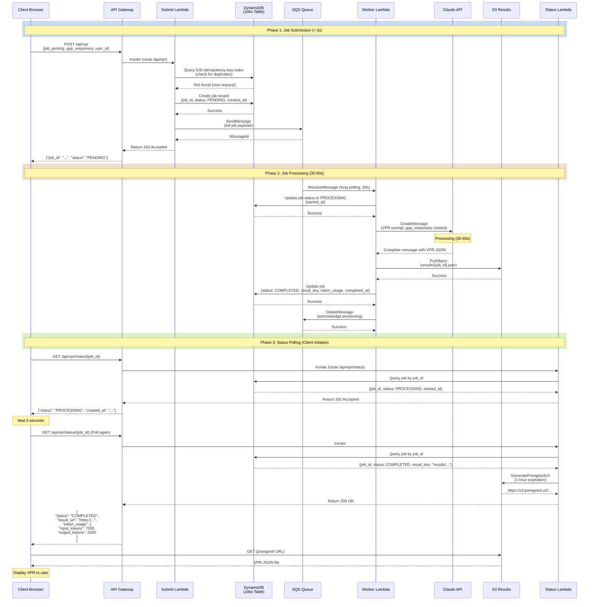

# VPR Async Architecture Design

## Overview

The VPR (Value Proposition Report) generation system transitions from synchronous to asynchronous execution to overcome the API Gateway 29-second timeout limitation. Claude Sonnet 4.5 requires 30-60 seconds to generate a complete VPR, making synchronous execution impossible in the current API Gateway constraint.

This document defines the complete async architecture, including system topology, state management, error handling, and integration patterns.

---

## System Architecture

### Problem Statement

**Current Bottleneck:**
- Claude Sonnet 4.5 VPR generation: 30-60 seconds
- API Gateway hard timeout: 29 seconds
- Result: 100% failure rate for VPR requests in production

**Solution Approach:**
Replace synchronous request-response with an asynchronous job queue pattern that decouples client submission from computation.

### Architecture Topology

```
┌─────────────────────────────────────────────────────────────────────┐
│                           CLIENT (Browser)                          │
└────────────────┬────────────────────────────────────────────────────┘
                 │
                 │ POST /api/vpr (with job payload)
                 ▼
         ┌───────────────────┐
         │  API Gateway      │
         │  (29s timeout)    │
         └────────┬──────────┘
                  │
                  │ Route to Lambda
                  ▼
         ┌───────────────────────────────────┐
         │  Submit Lambda (vpr-submit)       │
         │  • Validate request               │
         │  • Check idempotency key (GSI)    │
         │  • Create job record (PENDING)    │
         │  • Send message to SQS            │
         │  • Return 202 Accepted (job_id)   │
         │  Timeout: 10s | Memory: 256 MB    │
         └────────┬────────────────────────┬─┘
                  │                        │
    ┌─────────────▼──────────┐        ┌────▼──────────────┐
    │    DynamoDB Jobs Table │        │   SQS Queue       │
    │  • job_id (PK)         │        │   (4h retention)  │
    │  • status: PENDING     │        │   (20s long poll) │
    │  • created_at          │        │   (660s visibility)
    │  • input_data          │        │                   │
    │  • idempotency-key-idx │        │   ┌──────────────┐│
    │                        │        │   │   DLQ        ││
    │  TTL: 10 min           │        │   │ (max 3 retry)││
    └────────────────────────┘        │   └──────────────┘│
                                       │                   │
                                       │ Long poll message │
                                       ▼                   │
                             ┌──────────────────────────┐  │
                             │  Worker Lambda (polling) │◄─┘
                             │  • Fetch message from SQS│
                             │  • Update status→PROCESS │
                             │  • Call Claude API       │
                             │  • Generate VPR (30-60s) │
                             │  • Upload result to S3   │
                             │  • Update status→COMPLETE│
                             │  Timeout: 300s | Memory: 1GB
                             │  Concurrency: 5 (reserved)
                             └──────┬──────────────────┬─┘
                                    │                  │
                    ┌───────────────▼────┐  ┌──────────▼──────┐
                    │  S3 Results Bucket │  │ DynamoDB Update │
                    │  • result_key      │  │ • status:COMPLETE
                    │  • 7-day lifecycle │  │ • result_key    │
                    │  • Pre-signed URL  │  │ • completed_at  │
                    │    (1h expiration) │  │ • token_usage   │
                    └────────────────────┘  └─────────────────┘

                ┌──────────────────────────────────────┐
                │  Client Polling (5s intervals)       │
                │  GET /api/vpr/status/{job_id}        │
                │  • Return current job status         │
                │  • Include result_url if COMPLETED   │
                │  Max polling: 5 minutes (60 polls)   │
                │  Status Lambda timeout: 10s          │
                └──────────────────────────────────────┘
```

### Key Components

#### 1. Submit Lambda (`vpr-submit`)
- **Responsibility:** Receive VPR requests and queue them asynchronously
- **Timeout:** 10 seconds
- **Memory:** 256 MB
- **Concurrency:** Unreserved (auto-scales)
- **Actions:**
  1. Validate request payload (Pydantic schema)
  2. Compute idempotency key: `vpr#{user_id}#{application_id}`
  3. Query GSI `idempotency-key-index` for existing jobs
  4. If exists: return existing job status (deduplication)
  5. Create new job record in DynamoDB with status `PENDING`
  6. Send message to SQS queue
  7. Return HTTP 202 Accepted with `job_id`

#### 2. Worker Lambda (`vpr-worker`)
- **Responsibility:** Execute long-running VPR generation
- **Timeout:** 300 seconds (5 minutes)
- **Memory:** 1024 MB (required for Claude API + FVS computation)
- **Concurrency:** 5 reserved (cost and rate limit control)
- **Event Source:** SQS queue with long polling
- **Actions:**
  1. Receive SQS message containing full VPR request
  2. Update job status to `PROCESSING` in DynamoDB
  3. Call Claude Sonnet 4.5 API (30-60s call duration)
  4. Parse and validate Claude response
  5. Upload VPR result to S3 bucket
  6. Update DynamoDB job record: `COMPLETED` + `result_key` + `token_usage`
  7. Delete message from SQS queue
  8. **On error:** Update status to `FAILED`, include error message
  9. **On SQS failure:** Message requeue (max 3 retries → DLQ)

#### 3. Status Lambda (`vpr-status`)
- **Responsibility:** Provide read-only status queries
- **Timeout:** 10 seconds
- **Memory:** 256 MB
- **Concurrency:** Unreserved
- **Actions:**
  1. Validate `job_id` format (UUIDv4)
  2. Query DynamoDB jobs table by `job_id`
  3. If not found: return 404 (job expired after 10 min TTL)
  4. Return job status with timestamps
  5. If COMPLETED: generate S3 presigned URL (1-hour expiration)
  6. Include token usage metrics if available

#### 4. SQS Queue
- **Queue Name:** `careervp-vpr-jobs-queue-dev`
- **Visibility Timeout:** 660 seconds (11 minutes = 2× worker Lambda timeout)
- **Message Retention:** 4 hours
- **Long Polling:** 20 seconds (reduces API calls)
- **Dead Letter Queue:** `careervp-vpr-jobs-dlq-dev` with max 3 retries
- **Message Schema:**
  ```json
  {
    "job_id": "550e8400-e29b-41d4-a716-446655440000",
    "user_id": "user-123",
    "application_id": "app-456",
    "job_posting": {...},
    "gap_responses": [...],
    "submitted_at": "2026-02-03T13:05:32Z"
  }
  ```

#### 5. DynamoDB Jobs Table
- **Table Name:** `careervp-jobs-table-dev`
- **Billing Mode:** PAY_PER_REQUEST (suitable for bursty job submissions)
- **Partition Key:** `job_id` (UUIDv4)
- **Global Secondary Index:** `idempotency-key-index`
  - Partition key: `idempotency_key`
  - Projection: ALL (enables fast duplicate detection)
- **Time-To-Live:** 10 minutes (auto-cleanup completed/failed jobs)

#### 6. S3 Results Bucket
- **Bucket Name:** `careervp-dev-vpr-results-{region}-{id_suffix}`
- **Encryption:** S3-Managed (SSE-S3)
- **Block Public Access:** ALL (security hardening)
- **Lifecycle Rule:** Delete objects after 7 days
- **Presigned URLs:** 1-hour expiration (trade-off: security vs. accessibility)

---

## State Machine

### Job Status Lifecycle

```
┌─────────┐
│ PENDING │  Job submitted, waiting in queue
└────┬────┘
     │ Worker picks up message
     ▼
┌──────────────┐
│  PROCESSING  │  Claude API call in progress (30-60s)
└────┬─────────┘
     │
     ├─ Success (90-95%)
     │  └──────────────────────────┐
     │                             ▼
     │                       ┌───────────┐
     │                       │ COMPLETED │  Result available in S3
     │                       └───────────┘
     │
     └─ Failure (5-10%)
        └──────────────────────────┐
                                   ▼
                             ┌───────────┐
                             │  FAILED   │  Error details stored in job record
                             └───────────┘

   TTL Expiry (10 min) → Auto-deleted from DynamoDB
```

### Status Transition Rules

| Current | Trigger | Next | DynamoDB Updates |
|---------|---------|------|------------------|
| PENDING | Worker picks up SQS message | PROCESSING | `started_at`, `status` |
| PROCESSING | Claude API succeeds | COMPLETED | `completed_at`, `result_key`, `token_usage`, `status` |
| PROCESSING | Claude API fails | FAILED | `error`, `status` |
| PROCESSING | SQS message visibility timeout | PENDING | Automatic requeue (max 3 times) |
| FAILED | Max retries exceeded (3) | (DLQ) | Message moved to Dead Letter Queue |
| PENDING/PROCESSING | TTL expires (10 min) | (deleted) | Auto-deleted by DynamoDB |

### Job Record Schema

```python
@dataclass
class JobRecord:
    # Primary identifiers
    job_id: str                  # UUIDv4 - Partition key
    idempotency_key: str        # vpr#{user_id}#{application_id}
    user_id: str
    application_id: str

    # Status tracking
    status: Literal["PENDING", "PROCESSING", "COMPLETED", "FAILED"]
    created_at: datetime
    started_at: Optional[datetime]
    completed_at: Optional[datetime]

    # Input/Output
    input_data: dict            # Full VPRRequest payload
    result_key: Optional[str]   # S3 object key (e.g., "results/550e8400.json")
    error: Optional[str]        # Error message if FAILED

    # Metrics
    token_usage: Optional[dict] # {"input_tokens": 7500, "output_tokens": 2200}

    # Lifecycle
    ttl: int                    # Unix timestamp (10 min from created_at)
```

---

## Error Handling Strategy

### Error Categories

#### 1. **Claude API Timeout (30-60s)**
- **Cause:** Claude API response time exceeds worker Lambda timeout expectation
- **Detection:** `anthropic.APITimeout` exception
- **Recovery:** Update job status to FAILED, include timeout message
- **Client Impact:** User sees "VPR generation failed. Please try again."
- **Metrics:** Alert if timeout rate >5% (investigate Claude service degradation)

#### 2. **Claude API Rate Limit (429)**
- **Cause:** Account hits token-per-minute (TPM) limit (Tier 2: 4,000 TPM)
- **Detection:** `anthropic.RateLimitError` exception
- **Recovery:**
  - **First attempt:** Automatic SQS retry (up to 3 times)
  - **After 3 retries:** Message → DLQ, job status → FAILED
- **Backoff Strategy:** SQS visibility timeout handles retry spacing (660s = 11 min)
- **Capacity Planning:** Reserved worker concurrency = 5 ensures ~1 VPR/minute max throughput
- **Metrics:** Alert if DLQ has ≥1 message (indicates rate limit or service issue)

#### 3. **SQS Processing Failure (Worker Crash)**
- **Cause:** Unhandled exception in worker Lambda (e.g., S3 upload fails)
- **Mechanism:**
  1. Worker Lambda crashes before `DeleteMessage` on SQS
  2. Message visibility timeout expires (660s)
  3. SQS auto-requeues message for next polling cycle
  4. Max 3 requeue attempts enforced
  5. After 3rd failure: Message moved to DLQ
- **Recovery:** Manual intervention from ops team to debug DLQ messages
- **Client Impact:** Job stuck in PROCESSING state, client times out after 5 min

#### 4. **S3 Upload Failure**
- **Cause:** S3 service degradation or permission issue
- **Detection:** `botocore.S3Error` exception
- **Recovery:** Update job status to FAILED with error details
- **Mitigation:** Implement exponential backoff for S3 retry (up to 3 attempts)

#### 5. **DynamoDB Write Failure**
- **Cause:** DynamoDB throttling or service issue (rare with PAY_PER_REQUEST)
- **Detection:** `botocore.DynamoDBError`
- **Recovery:** For status updates: retry with exponential backoff (up to 3 times)
- **Critical Paths:** Job creation (submit Lambda) has higher priority than updates

#### 6. **Invalid Input Data**
- **Cause:** Malformed request (missing fields, invalid JSON)
- **Detection:** Pydantic validation failure
- **Recovery:** Return 400 Bad Request with schema error details
- **Client Impact:** Immediate feedback, no job created

### Dead Letter Queue (DLQ) Strategy

The DLQ captures unrecoverable failures for operator review.

**DLQ Configuration:**
- Queue name: `careervp-vpr-jobs-dlq-dev`
- Retention: 14 days (sufficient for post-mortem analysis)
- Max retries: 3 attempts before moving to DLQ

**DLQ Message Anatomy:**
```json
{
  "MessageId": "559c71d2-b24c-4a81-9f15-ba1c7c2d2b8c",
  "ReceiptHandle": "...",
  "Body": {
    "job_id": "550e8400-e29b-41d4-a716-446655440000",
    "user_id": "user-123",
    "application_id": "app-456",
    "original_error": "Claude API rate limit exceeded (429)"
  },
  "Attributes": {
    "ApproximateReceiveCount": "4",
    "SentTimestamp": "1738598400000",
    "SenderId": "123456789012",
    "ApproximateFirstReceiveTimestamp": "1738598400000"
  }
}
```

**DLQ Monitoring:**
- CloudWatch Alarm: `careervp-vpr-dlq-alarm-dev`
  - Metric: `ApproximateNumberOfMessagesVisible`
  - Threshold: ≥1 message
  - Action: Send SNS notification to ops team
  - Treat missing data: NOT_BREACHING (avoid false alarms)

**Operator Response:**
1. Receive alarm notification
2. Inspect DLQ message to determine failure pattern
3. If systemic (e.g., Claude service down): notify product team
4. If transient (e.g., network blip): manually retry
5. If data corruption: update job status to FAILED + notify user

### Retry Logic

```
Submit Lambda (idempotent)
├─ New request
│  ├─ Create job in PENDING state
│  ├─ Send to SQS
│  └─ Return 202 Accepted
│
└─ Duplicate request (idempotency key exists)
   ├─ Return existing job status
   └─ No Claude API call (prevents duplicate charges)

Worker Lambda (with backoff)
├─ Retrieve SQS message
├─ Update status to PROCESSING
│
├─ Call Claude API
│  ├─ Success (200)
│  │  └─ Upload to S3 → Update COMPLETED → Delete message
│  │
│  └─ Failure (429/timeout/5xx)
│     ├─ Update status to FAILED
│     ├─ Do NOT delete SQS message (triggers auto-retry)
│     ├─ Retry count incremented by SQS
│     │
│     └─ After 3 retries
│        └─ Message moved to DLQ (SQS automatic)
│
└─ SQS visibility timeout (660s)
   └─ Auto-requeue if not deleted

Status Lambda (read-only)
├─ Query DynamoDB by job_id
├─ If COMPLETED
│  ├─ Generate S3 presigned URL
│  └─ Return 200 with result_url
├─ If PROCESSING/PENDING
│  └─ Return 202 with status
└─ If FAILED
   └─ Return 200 with error message
```

---

## Async Handshake Sequence Diagram



### Sequence Explanation

**Phase 1: Job Submission (< 3 seconds)**
1. Client submits VPR request with job posting and gap responses
2. API Gateway routes to Submit Lambda
3. Submit Lambda checks idempotency key (deduplication via GSI)
4. Creates job record in PENDING state with TTL of 10 minutes
5. Sends message to SQS queue
6. Returns 202 Accepted with job_id (client gets immediate feedback)
7. Total latency: < 3 seconds (well within API Gateway 29s limit)

**Phase 2: Job Processing (30-60 seconds)**
1. Worker Lambda polls SQS queue using long polling (20s wait)
2. Receives message containing full job payload
3. Updates job status to PROCESSING in DynamoDB
4. Calls Claude Sonnet 4.5 API to generate VPR (30-60s)
5. Uploads VPR result to S3 bucket
6. Updates job record: status = COMPLETED, result_key, token_usage
7. Deletes message from SQS (acknowledges successful processing)
8. **On error:** Updates status to FAILED, leaves message in SQS (triggers retry)

**Phase 3: Status Polling (Client-driven)**
1. Client polls GET /api/vpr/status/{job_id} every 5 seconds
2. Status Lambda queries DynamoDB for job record
3. Returns job status with timestamps (202 while processing, 200 when complete)
4. When COMPLETED, generates 1-hour presigned S3 URL
5. Client fetches VPR from presigned URL
6. Max polling duration: 5 minutes (60 polls × 5s)
7. If timeout after 5 min: show "Generation is taking longer than expected"

---

## API Contract

### Submit VPR Job

**Endpoint:** `POST /api/vpr`

**Request Headers:**
```
Content-Type: application/json
Authorization: Bearer {auth_token}
Idempotency-Key: vpr#{user_id}#{application_id}  # Optional, computed server-side
```

**Request Body:**
```json
{
  "application_id": "app-uuid-123",
  "user_id": "user-uuid-456",
  "job_posting": {
    "company_name": "Natural Intelligence",
    "role_title": "Learning & Development Manager",
    "responsibilities": [
      "Design and deliver employee development programs",
      "Evaluate learning gaps for the team"
    ],
    "requirements": [
      "5+ years of L&D experience",
      "Master's degree in relevant field"
    ]
  },
  "gap_responses": [
    {
      "question": "Describe your L&D experience",
      "answer": "I have 7 years managing learning programs at tech startups..."
    }
  ]
}
```

**Response (202 - New Job):**
```json
{
  "statusCode": 202,
  "body": {
    "job_id": "550e8400-e29b-41d4-a716-446655440000",
    "status": "PENDING",
    "message": "VPR generation job submitted successfully. Poll /api/vpr/status/{job_id} for updates."
  }
}
```

**Response (200 - Duplicate Request via Idempotency Key):**
```json
{
  "statusCode": 200,
  "body": {
    "job_id": "550e8400-e29b-41d4-a716-446655440000",
    "status": "PROCESSING",
    "message": "Job already exists. Use this job_id to poll for status."
  }
}
```

**Response (400 - Validation Error):**
```json
{
  "statusCode": 400,
  "body": {
    "error": "Invalid request",
    "details": [
      {
        "field": "gap_responses",
        "message": "Expected list, got null"
      }
    ]
  }
}
```

**Idempotency Semantics:**
- Key: `vpr#{user_id}#{application_id}`
- TTL: 24 hours (allows regeneration after 1 day)
- Prevents duplicate Claude API charges if client retries submission
- Returns existing job status without creating new job

---

### Check Job Status

**Endpoint:** `GET /api/vpr/status/{job_id}`

**Path Parameters:**
- `job_id` (string, UUIDv4): Job identifier from submit response

**Query Parameters:**
- `include_metrics` (boolean, optional): Include token usage in response

**Response (202 - Processing):**
```json
{
  "statusCode": 202,
  "body": {
    "job_id": "550e8400-e29b-41d4-a716-446655440000",
    "status": "PROCESSING",
    "created_at": "2026-02-03T13:05:32Z",
    "started_at": "2026-02-03T13:05:35Z",
    "elapsed_seconds": 27
  }
}
```

**Response (200 - Completed):**
```json
{
  "statusCode": 200,
  "body": {
    "job_id": "550e8400-e29b-41d4-a716-446655440000",
    "status": "COMPLETED",
    "created_at": "2026-02-03T13:05:32Z",
    "started_at": "2026-02-03T13:05:35Z",
    "completed_at": "2026-02-03T13:06:12Z",
    "duration_seconds": 40,
    "result_url": "https://s3.us-east-1.amazonaws.com/careervp-dev-vpr-results-use1-abc123/results/550e8400.json?X-Amz-Algorithm=AWS4-HMAC-SHA256&...",
    "token_usage": {
      "input_tokens": 7500,
      "output_tokens": 2200,
      "total_tokens": 9700
    }
  }
}
```

**Response (200 - Failed):**
```json
{
  "statusCode": 200,
  "body": {
    "job_id": "550e8400-e29b-41d4-a716-446655440000",
    "status": "FAILED",
    "created_at": "2026-02-03T13:05:32Z",
    "started_at": "2026-02-03T13:05:35Z",
    "error": "Claude API rate limit exceeded (429). Job will retry automatically.",
    "retry_count": 2
  }
}
```

**Response (404 - Not Found):**
```json
{
  "statusCode": 404,
  "body": {
    "error": "Job not found",
    "message": "Job may have expired after 10 minutes of inactivity"
  }
}
```

**Response (400 - Invalid job_id):**
```json
{
  "statusCode": 400,
  "body": {
    "error": "Invalid job_id format",
    "message": "job_id must be a valid UUIDv4"
  }
}
```

---

## Data Schemas

### DynamoDB Jobs Table

**Table Name:** `careervp-jobs-table-dev`

**Attributes:**

| Attribute | Type | Required | Example | Purpose |
|-----------|------|----------|---------|---------|
| `job_id` | String | Yes | `550e8400-e29b-41d4-a716-446655440000` | Primary key (partition key) |
| `idempotency_key` | String | Yes | `vpr#user-123#app-456` | GSI partition key (deduplication) |
| `user_id` | String | Yes | `user-uuid-123` | User who submitted job |
| `application_id` | String | Yes | `app-uuid-456` | Application context |
| `status` | String (enum) | Yes | `PENDING` \| `PROCESSING` \| `COMPLETED` \| `FAILED` | Job state |
| `created_at` | String (ISO 8601) | Yes | `2026-02-03T13:05:32Z` | Job creation timestamp |
| `started_at` | String (ISO 8601) | No | `2026-02-03T13:05:35Z` | Worker start timestamp |
| `completed_at` | String (ISO 8601) | No | `2026-02-03T13:06:12Z` | Job completion timestamp |
| `input_data` | Map | Yes | `{job_posting: {...}, gap_responses: [...]}` | Full VPR request payload |
| `result_key` | String | No | `results/550e8400.json` | S3 object key for VPR file |
| `error` | String | No | `Claude API rate limit exceeded` | Error message if FAILED |
| `token_usage` | Map | No | `{input_tokens: 7500, output_tokens: 2200}` | Claude API token metrics |
| `ttl` | Number | Yes | `1738598400` | Unix timestamp for auto-deletion (10 min) |

**Global Secondary Index (GSI) - `idempotency-key-index`:**
- Partition Key: `idempotency_key`
- Projection Type: ALL
- Purpose: Fast duplicate request detection
- Query Pattern: `SELECT * FROM jobs WHERE idempotency_key = 'vpr#user-123#app-456'`

**Lifecycle:**
- TTL Attribute: `ttl` (set to `created_at + 600 seconds`)
- Auto-deletion: DynamoDB automatically deletes items after TTL expires
- Typical lifetime: 10 minutes for completed jobs, 5-60 minutes for processing

### S3 Results Object

**Bucket:** `careervp-dev-vpr-results-{region}-{id_suffix}`

**Object Path:** `results/{job_id}.json`

**Content Type:** `application/json`

**Encryption:** S3-Managed (SSE-S3)

**Example File (VPR JSON):**
```json
{
  "job_id": "550e8400-e29b-41d4-a716-446655440000",
  "generated_at": "2026-02-03T13:06:12Z",
  "executive_summary": "Your Value Proposition Report...",
  "top_strengths": [
    "7 years of proven L&D leadership at scale",
    "Strong background in tech industry culture"
  ],
  "gaps": [
    "Limited experience with specific HRIS platforms",
    "Master's degree requirement not met"
  ],
  "recommendations": [
    "Highlight transferable skills in team development",
    "Consider pursuing SHRM certification to address education gap"
  ],
  "section_scores": {
    "experience_match": 0.85,
    "skills_match": 0.78,
    "education_match": 0.65
  }
}
```

**Lifecycle:**
- Lifecycle Rule: `DeleteOldResults`
- Expiration: 7 days after creation
- Purpose: Auto-cleanup to manage storage costs
- Presigned URL Expiration: 1 hour from generation

### SQS Message Schema

**Queue:** `careervp-vpr-jobs-queue-dev`

**Message Body:**
```json
{
  "job_id": "550e8400-e29b-41d4-a716-446655440000",
  "user_id": "user-uuid-123",
  "application_id": "app-uuid-456",
  "job_posting": {
    "company_name": "Natural Intelligence",
    "role_title": "Learning & Development Manager",
    "responsibilities": [...],
    "requirements": [...]
  },
  "gap_responses": [
    {
      "question": "Describe your L&D experience",
      "answer": "..."
    }
  ],
  "submitted_at": "2026-02-03T13:05:32Z"
}
```

**Message Attributes:**
- `MessageId`: AWS-generated unique identifier
- `ReceiptHandle`: Used by worker to delete message after processing
- `ApproximateReceiveCount`: Number of receive attempts (max 3 before DLQ)
- `ApproximateFirstReceiveTimestamp`: When message first received

**Processing Guarantees:**
- At-least-once delivery (default SQS semantics)
- Idempotency handled by job_id uniqueness in DynamoDB
- Visibility timeout (660s) > Worker timeout (300s) prevents duplicate processing

---

## Cost Analysis

### Per-VPR Cost Breakdown

| Component | Count/Invocation | Unit Cost | Total/VPR |
|-----------|------------------|-----------|-----------|
| **API Gateway** | | | |
| Submit endpoint | 1 | $0.0000035/req | $0.0000035 |
| Status endpoint | 12 (avg polling) | $0.000035/req | $0.00042 |
| **Lambda** | | | |
| Submit Lambda | 1 inv × 5s | $0.0000002/100ms | $0.000001 |
| Worker Lambda | 1 inv × 45s (avg) | $0.000008/100ms | $0.0036 |
| Status Lambda | 12 inv × 1s | $0.0000002/100ms | $0.0000024 |
| **SQS** | | | |
| SendMessage | 1 | $0.0000008/req | $0.0000008 |
| ReceiveMessage | 1 | $0.0000008/req | $0.0000008 |
| DeleteMessage | 1 | $0.0000008/req | $0.0000008 |
| **DynamoDB** | | | |
| Write (create job) | 1 | $0.00000125/WU | $0.00000125 |
| Write (update status) | 3 | $0.00000125/WU | $0.00000375 |
| Query (GSI) | 1 | $0.00000125/RU | $0.00000125 |
| Query (status) | 12 | $0.00000125/RU | $0.000015 |
| **S3** | | | |
| PutObject | 1 | $0.0000005/req | $0.0000005 |
| GetObject (via presigned) | 1 | $0.0000005/req | $0.0000005 |
| **Claude API** | | | |
| Input tokens | 7,500 avg | $0.003/1M | $0.0225 |
| Output tokens | 2,200 avg | $0.012/1M | $0.0264 |
| | | **Total Claude** | **$0.0489** |
| | | | |
| | | **Total AWS** | **$0.0058** |
| | | **Total/VPR** | **$0.0547** |

**Key Insights:**
- Claude API dominates cost (~89% of total)
- AWS infrastructure cost: ~$0.0058 per VPR
- Target budget: $0.10 per VPR
- Headroom: 83% ($0.0453 unused)
- Reserved worker concurrency (5): ~$0.065/minute at peak = acceptable for MVP

---

## Security & Data Protection

### Access Control (IAM Least Privilege)

**Submit Lambda Permissions:**
- `dynamodb:PutItem` on jobs table (write new jobs)
- `dynamodb:Query` on idempotency-key-index (check duplicates)
- `sqs:SendMessage` to vpr-jobs-queue

**Worker Lambda Permissions:**
- `dynamodb:GetItem` on jobs table (read job record)
- `dynamodb:UpdateItem` on jobs table (update status/result_key)
- `sqs:ReceiveMessage` from vpr-jobs-queue
- `sqs:DeleteMessage` from vpr-jobs-queue
- `s3:PutObject` to vpr-results-bucket
- `dynamodb:Query` on users table (read user for validation)

**Status Lambda Permissions:**
- `dynamodb:GetItem` on jobs table (read-only status)
- `s3:GetObject` on vpr-results-bucket (generate presigned URL only)

### Attack Surface Mitigation

| Attack Vector | Mitigation | Mechanism |
|---------------|-----------|-----------|
| **Job ID Enumeration** | UUIDv4 (128-bit entropy) + User ownership validation | Return 404 for jobs not owned by requesting user |
| **Idempotency Key Collision** | Compute server-side with user_id + app_id + timestamp | Impossible for different users to collide |
| **DDoS via Job Submission** | API Gateway throttling: 2 req/s per user, 10 burst | Reject excess requests with 429 Too Many Requests |
| **Malicious Input Injection** | Pydantic schema validation + input escaping | Reject invalid JSON before Claude API call |
| **S3 Presigned URL Abuse** | 1-hour expiration + user ownership check | URLs expire automatically, user must own job |
| **SQS Message Tampering** | Validate message schema before processing | Reject malformed messages, send to DLQ |
| **Replay Attacks** | Idempotency key prevents duplicate processing within 24h | Second request with same key returns existing job |
| **Unauthorized Status Check** | Return 404 for jobs not owned by requesting user | Validate user_id in authorization context |

### Data Protection

**Encryption in Transit:**
- All API calls: TLS 1.2+ (enforced by AWS)
- DynamoDB access: TLS 1.2+
- S3 access: TLS 1.2+
- SQS messages: TLS 1.2+

**Encryption at Rest:**
- **DynamoDB:** AWS-owned keys (default, sufficient for MVP)
  - Can upgrade to customer-managed keys (KMS) if required
- **S3:** S3-Managed encryption (SSE-S3)
  - Can upgrade to KMS for additional audit trail
- **SQS:** AWS-owned keys (default)
  - Messages encrypted in transit but not at rest (acceptable for MVP)

**Data Retention:**
- DynamoDB jobs: 10 minutes (TTL auto-deletion)
- S3 VPR results: 7 days (lifecycle rule)
- SQS messages: 4 hours (retention period)
- Idempotency keys: 24 hours (GSI TTL)
- User input (gap_responses): Not persisted beyond DynamoDB TTL

**Compliance Considerations:**
- No PHI/PII in VPR results (job posting is public, gap responses are user-owned)
- Results not accessible to other users (presigned URL + user ownership validation)
- Audit trail: CloudWatch Logs on all Lambda invocations (configurable retention)

---

## Performance & Monitoring

### Key Metrics

| Metric | Target | Alert Threshold | Collection |
|--------|--------|-----------------|-----------|
| **VPR Generation Time** | <60s (p95) | >90s (p99) | CloudWatch Lambda Duration |
| **E2E Latency (submit to complete)** | <120s (p95) | >180s (p99) | Custom metric: `completed_at - created_at` |
| **Submit Latency** | <3s (p99) | >10s (p99) | CloudWatch Lambda Duration (submit) |
| **Queue Depth** | <10 (steady-state) | >50 (surge) | CloudWatch SQS ApproximateNumberOfMessages |
| **DLQ Message Count** | 0 | ≥1 (immediate) | CloudWatch SQS DLQ ApproximateNumberOfMessages |
| **Worker Error Rate** | <1% | >5% over 5 min | CloudWatch Lambda Errors |
| **Worker Timeout Rate** | <0.1% | >1% | CloudWatch Lambda Duration timeouts |
| **API Gateway 4xx Rate** | <2% | >10% | CloudWatch API Gateway 4xx |
| **API Gateway 5xx Rate** | <0.1% | >1% | CloudWatch API Gateway 5xx |
| **Cost per VPR** | <$0.01 | >$0.05 | Custom metric: total AWS cost / job count |

### CloudWatch Alarms

**1. DLQ Alarm (Critical)**
- **Alarm Name:** `careervp-vpr-dlq-alarm-dev`
- **Metric:** `ApproximateNumberOfMessagesVisible` on DLQ
- **Threshold:** ≥1 message
- **Evaluation:** 1 period of 1 minute
- **Action:** SNS notification to ops@careervp.com
- **Suppress:** Don't alert if SQS service is degraded

**2. Worker Error Rate Alarm (High)**
- **Alarm Name:** `careervp-vpr-worker-errors-alarm-dev`
- **Metric:** CloudWatch Lambda Errors (worker)
- **Threshold:** >5% error rate over 5 minutes
- **Evaluation:** 5 periods of 1 minute each
- **Action:** SNS notification + trigger incident investigation
- **Context:** May indicate Claude API service degradation

**3. Queue Depth Alarm (Medium)**
- **Alarm Name:** `careervp-vpr-queue-depth-alarm-dev`
- **Metric:** `ApproximateNumberOfMessages` on queue
- **Threshold:** >50 messages (backlog building)
- **Evaluation:** 2 periods of 1 minute each
- **Action:** SNS notification (warning, not critical)
- **Context:** Indicates either high submission rate or worker issues

**4. Worker Timeout Alarm (Medium)**
- **Alarm Name:** `careervp-vpr-worker-timeout-alarm-dev`
- **Metric:** CloudWatch Lambda Duration (worker)
- **Threshold:** >300s (worker timeout limit)
- **Evaluation:** If any invocation exceeds 300s
- **Action:** CloudWatch Logs + manual investigation
- **Context:** May indicate Claude API performance degradation

### CloudWatch Dashboard

Create a dashboard with key panels:

```
Dashboard: CareerVP VPR Async Monitoring

┌─ VPR Generation Performance
│  ├─ Generation Time (p95, p99) - Line chart
│  ├─ E2E Latency (submit to complete) - Line chart
│  └─ Success Rate (%) - Single value
│
├─ Queue Health
│  ├─ Queue Depth - Line chart
│  ├─ DLQ Messages - Single value (red if > 0)
│  └─ Message Processing Rate - Line chart
│
├─ Lambda Performance
│  ├─ Worker Error Rate (%) - Line chart with threshold at 5%
│  ├─ Timeout Count - Single value
│  └─ Invocation Duration (p50, p95) - Box plot
│
└─ Cost & Capacity
   ├─ Cost per VPR ($) - Line chart
   ├─ Total Jobs Processed - Single value
   └─ Reserved Concurrency Utilization (%) - Gauge
```

### Log Aggregation

Enable CloudWatch Logs for all Lambda functions:

**Submit Lambda Logs:**
```
[timestamp] [job_id] action=create_job status=PENDING user_id=... app_id=...
[timestamp] [job_id] action=enqueue_sqs result=success queue_depth=5
[timestamp] [job_id] action=return_response status_code=202
```

**Worker Lambda Logs:**
```
[timestamp] [job_id] action=receive_message source=sqs
[timestamp] [job_id] action=update_status from=PENDING to=PROCESSING
[timestamp] [job_id] action=call_claude duration=45s tokens_in=7500 tokens_out=2200
[timestamp] [job_id] action=upload_result bucket=... key=results/550e8400.json size_kb=25
[timestamp] [job_id] action=update_status from=PROCESSING to=COMPLETED
[timestamp] [job_id] action=delete_message source=sqs result=success
```

**Status Lambda Logs:**
```
[timestamp] [job_id] action=query_job status=COMPLETED
[timestamp] [job_id] action=generate_presigned_url expiration=3600s
[timestamp] [job_id] action=return_response status_code=200
```

**Query Examples:**
```
# Find all failed jobs in last 24h
fields @timestamp, job_id, error | filter status = "FAILED" | stats count() by error

# Find jobs that timed out
fields @timestamp, job_id, duration | filter duration > 300 | stats count()

# Find average generation time
fields @timestamp, duration | filter action = "call_claude" | stats avg(duration), max(duration), pct(duration, 95)
```

---

## Frontend Integration

### Client Polling Pattern

**High-Level Flow:**
```typescript
// Step 1: Submit VPR job
const submitResponse = await fetch('/api/vpr', {
  method: 'POST',
  headers: { 'Content-Type': 'application/json' },
  body: JSON.stringify({ user_id, application_id, job_posting, gap_responses })
});
const { job_id } = await submitResponse.json();

// Step 2: Poll for status (every 5 seconds, max 5 minutes)
let status = 'PENDING';
let pollCount = 0;
while (status !== 'COMPLETED' && status !== 'FAILED' && pollCount < 60) {
  await sleep(5000);  // Wait 5 seconds before polling
  const statusResponse = await fetch(`/api/vpr/status/${job_id}`);
  const job = await statusResponse.json();
  status = job.status;
  pollCount++;
}

// Step 3: Fetch result from S3 presigned URL
if (status === 'COMPLETED') {
  const resultResponse = await fetch(job.result_url);
  const vpr = await resultResponse.json();
  displayVPR(vpr);
} else if (status === 'FAILED') {
  showError(`VPR generation failed: ${job.error}`);
}
```

### UX States & UI Display

| Status | HTTP Code | UI Display | User Experience |
|--------|-----------|-----------|------------------|
| PENDING | 202 | 🟡 "VPR generation queued..." | Spinner, waiting message |
| PROCESSING | 202 | 🔵 "Generating your personalized Value Proposition Report..." | Animated spinner, progress message |
| COMPLETED | 200 | ✅ "VPR complete! Displaying results..." | Show VPR content |
| FAILED | 200 | ❌ "Unable to generate report. Please try again." | Error message, retry button |
| TIMEOUT (>5 min) | N/A | ⏱️ "Generation is taking longer than expected. Please check back later." | Timeout message, check-again button |

### React Component Example

```typescript
import { useState, useEffect } from 'react';

interface VPRPollerProps {
  jobId: string;
  onComplete: (resultUrl: string) => void;
  onError: (error: string) => void;
}

export function VPRStatusPoller({ jobId, onComplete, onError }: VPRPollerProps) {
  const [status, setStatus] = useState<'PENDING' | 'PROCESSING' | 'COMPLETED' | 'FAILED'>('PENDING');
  const [elapsed, setElapsed] = useState(0);
  const [pollCount, setPollCount] = useState(0);

  const MAX_POLLS = 60;  // 5 minutes at 5s interval
  const POLL_INTERVAL = 5000;  // 5 seconds

  useEffect(() => {
    if (pollCount >= MAX_POLLS) {
      onError('VPR generation timeout. Please try again later.');
      return;
    }

    const timer = setTimeout(async () => {
      try {
        const response = await fetch(`/api/vpr/status/${jobId}`);
        const data = await response.json();

        setStatus(data.status);
        setElapsed(data.elapsed_seconds || (pollCount * 5));

        if (data.status === 'COMPLETED') {
          onComplete(data.result_url);
        } else if (data.status === 'FAILED') {
          onError(data.error);
        } else {
          setPollCount(prev => prev + 1);
        }
      } catch (error) {
        console.error('Failed to fetch status:', error);
        setPollCount(prev => prev + 1);
      }
    }, POLL_INTERVAL);

    return () => clearTimeout(timer);
  }, [jobId, pollCount, onComplete, onError]);

  return (
    <div className="vpr-status-container">
      {status === 'PENDING' && (
        <div className="status-pending">
          <div className="spinner"></div>
          <p>VPR generation queued...</p>
        </div>
      )}

      {status === 'PROCESSING' && (
        <div className="status-processing">
          <div className="spinner"></div>
          <p>Generating your personalized Value Proposition Report...</p>
          <p className="elapsed-time">Elapsed: {elapsed}s</p>
        </div>
      )}

      {status === 'FAILED' && (
        <div className="status-failed">
          <p className="error">Unable to generate report. Please try again.</p>
          <button onClick={() => window.location.reload()}>Retry</button>
        </div>
      )}
    </div>
  );
}

// Usage in VPRGenerator component
export function VPRGenerator() {
  const [jobId, setJobId] = useState<string | null>(null);
  const [resultUrl, setResultUrl] = useState<string | null>(null);
  const [error, setError] = useState<string | null>(null);

  const handleSubmit = async (formData: VPRRequest) => {
    const response = await fetch('/api/vpr', {
      method: 'POST',
      headers: { 'Content-Type': 'application/json' },
      body: JSON.stringify(formData)
    });

    const data = await response.json();
    setJobId(data.job_id);
  };

  if (!jobId) {
    return <VPRForm onSubmit={handleSubmit} />;
  }

  if (resultUrl) {
    return <VPRDisplay resultUrl={resultUrl} />;
  }

  return (
    <VPRStatusPoller
      jobId={jobId}
      onComplete={setResultUrl}
      onError={setError}
    />
  );
}
```

### Polling Best Practices

1. **Exponential Backoff (Optional):** Start with 1s polling, increase to 5s after 10 polls to reduce load
2. **Request Deduplication:** Include request ID in headers to avoid duplicate submissions
3. **Network Error Handling:** Retry failed status requests with exponential backoff (max 3 retries per poll)
4. **User Feedback:** Show elapsed time and remaining time estimate (max 5 minutes)
5. **Cleanup:** Clear polling timer on component unmount to prevent memory leaks
6. **Analytics:** Track submission-to-completion time for performance monitoring

---

## Migration Strategy

### Phase 1: Deploy Infrastructure (Week 1)

**Goal:** Deploy async resources without impacting existing synchronous endpoint.

**Tasks:**
1. Deploy SQS queue + DLQ
2. Deploy DynamoDB jobs table with GSI
3. Deploy S3 results bucket with lifecycle rule
4. Deploy worker Lambda (SQS event source mapping)
5. Deploy status Lambda (API Gateway route)
6. Deploy CloudWatch alarms
7. Test infrastructure in isolation

**Verification:**
```bash
# Verify SQS queue
aws sqs get-queue-url --queue-name careervp-vpr-jobs-queue-dev
aws sqs get-queue-attributes --queue-url $(aws sqs get-queue-url --queue-name careervp-vpr-jobs-queue-dev --query 'QueueUrl' --output text) --attribute-names All

# Verify DynamoDB table
aws dynamodb describe-table --table-name careervp-jobs-table-dev
aws dynamodb describe-table --table-name careervp-jobs-table-dev | jq '.Table.GlobalSecondaryIndexes[] | select(.IndexName == "idempotency-key-index")'

# Verify S3 bucket
aws s3 ls | grep careervp.*vpr-results
aws s3api get-bucket-lifecycle-configuration --bucket $(aws s3 ls | grep careervp.*vpr-results | awk '{print $3}')
```

**Risk:** LOW (new resources, zero impact on existing endpoint)

---

### Phase 2: Refactor Submit Handler (Week 2)

**Goal:** Convert `POST /api/vpr` from synchronous to asynchronous.

**Tasks:**
1. Create `vpr_submit_handler.py` (new async submit logic)
2. Move VPR generation to `vpr_worker_handler.py`
3. Implement idempotency check via GSI query
4. Create job record in DynamoDB (status: PENDING)
5. Send message to SQS queue
6. Return 202 Accepted
7. Deploy to dev environment
8. Run integration tests

**Verification:**
```bash
# Test submit endpoint
curl -X POST http://localhost:8000/api/vpr \
  -H "Content-Type: application/json" \
  -d '{
    "application_id": "test-app",
    "user_id": "test-user",
    "job_posting": {...},
    "gap_responses": [...]
  }'
# Expected: 202 Accepted with job_id

# Test duplicate request (idempotency)
curl -X POST http://localhost:8000/api/vpr \
  -H "Content-Type: application/json" \
  -d '...'  # Same payload
# Expected: 200 OK with existing job_id
```

**Risk:** MEDIUM (modifies critical endpoint, requires frontend update)

**Rollback Plan:** Keep synchronous handler available, route traffic via A/B testing

---

### Phase 3: Frontend Polling Implementation (Week 2)

**Goal:** Update frontend to poll for async status.

**Tasks:**
1. Create `VPRStatusPoller.tsx` component
2. Update VPR submission flow to handle 202 Accepted
3. Implement polling logic (5s intervals, 5 min timeout)
4. Add loading spinner and status messages
5. Implement error handling and retry logic
6. Deploy to dev environment
7. Run end-to-end tests

**Verification:**
- Submit VPR → Receive 202 with job_id
- Poll status → See PENDING → PROCESSING states
- Wait for completion → See 200 with result_url
- Fetch VPR from presigned URL → Verify content

**Risk:** MEDIUM (user-facing UX change)

---

### Phase 4: Gradual Production Rollout (Week 3)

**Goal:** Migrate production traffic with continuous monitoring.

**Tasks:**
1. Deploy to prod environment (with async infrastructure)
2. Run load tests (100 concurrent submissions)
3. Monitor metrics for 24 hours
4. Route 10% traffic to async endpoint (90% to synchronous)
5. Monitor for 24 hours
6. Route 50% traffic to async endpoint
7. Monitor for 24 hours
8. Route 100% traffic to async endpoint
9. Deprecate synchronous code path

**Monitoring Checklist:**
- [ ] Success rate: >99%
- [ ] P95 generation time: <75s
- [ ] Queue depth: <10
- [ ] DLQ messages: 0
- [ ] Cost per VPR: <$0.002
- [ ] User complaints: 0
- [ ] API error rate: <0.1%

**Risk:** LOW (gradual rollout with monitoring, easy rollback)

---

## Testing Strategy

### Unit Tests

**Submit Lambda:**
- Test idempotency key computation
- Test GSI query for duplicate detection
- Test job record creation (PENDING status)
- Test SQS message send
- Test validation error handling
- Test 400 Bad Request response

**Worker Lambda:**
- Test SQS message parsing
- Test status update to PROCESSING
- Test Claude API call (mock)
- Test result upload to S3 (mock)
- Test status update to COMPLETED
- Test error handling (Claude API timeout, S3 failure)
- Test DLQ requeue on error

**Status Lambda:**
- Test job_id validation (UUIDv4)
- Test DynamoDB query
- Test presigned URL generation
- Test 404 for missing jobs
- Test 202 for processing jobs
- Test 200 for completed jobs

### Integration Tests

**Submit → Worker → Status Flow:**
1. Call `POST /api/vpr` with valid payload
2. Verify 202 response with job_id
3. Poll `GET /api/vpr/status/{job_id}` (should be PENDING)
4. Wait for worker to process message
5. Poll status again (should be PROCESSING)
6. Wait for worker to complete
7. Poll status again (should be COMPLETED)
8. Fetch presigned URL
9. Verify VPR content in S3

**Idempotency Test:**
1. Submit VPR request A
2. Receive job_id X (status: PENDING)
3. Submit VPR request A again (same payload)
4. Receive job_id X (status: should not change)
5. Verify only one Claude API call was made

**Error Handling Test:**
1. Submit VPR request
2. Mock Claude API to return rate limit error (429)
3. Verify job status → FAILED
4. Verify message requeue in SQS
5. Mock recovery of Claude API
6. Verify worker retries and succeeds
7. Verify job status → COMPLETED

### Load Tests

**100 Concurrent Submissions:**
```python
# Load test script
concurrent_jobs = 100
results = []

async def submit_vpr(user_id, app_id):
    response = await client.post('/api/vpr', json={...})
    return response.json()

responses = await asyncio.gather(*[
    submit_vpr(f'user-{i}', f'app-{i}')
    for i in range(concurrent_jobs)
])

# Verify
assert len(responses) == 100
assert all(r['statusCode'] == 202 for r in responses)
assert len(set(r['job_id'] for r in responses)) == 100  # All unique

# Monitor queue depth
queue_depth = get_queue_depth()
assert queue_depth <= 100  # All jobs queued
```

**Queue Backlog Test:**
```bash
# Submit 500 jobs rapidly
for i in {1..500}; do
  curl -X POST /api/vpr -d "{...}" &
done

# Monitor queue depth and worker throughput
aws sqs get-queue-attributes --queue-url ... --attribute-names ApproximateNumberOfMessages

# Expected: queue depth peaks at ~500, decreases as workers process
# Worker concurrency (5) should process ~1 job/minute
# Full queue cleared in ~100 minutes
```

---

## References & Related Documentation

- **Original VPR Spec:** [docs/specs/03-vpr-generator.md](/Users/yitzchak/Documents/dev/careervp/docs/specs/03-vpr-generator.md)
- **Async Architecture Spec:** [docs/specs/07-vpr-async-architecture.md](/Users/yitzchak/Documents/dev/careervp/docs/specs/07-vpr-async-architecture.md)
- **Infrastructure Task:** [docs/tasks/07-vpr-async/task-01-infrastructure.md](/Users/yitzchak/Documents/dev/careervp/docs/tasks/07-vpr-async/task-01-infrastructure.md)
- **AWS SQS Best Practices:** https://docs.aws.amazon.com/AWSSimpleQueueService/latest/SQSDeveloperGuide/sqs-best-practices.html
- **AWS Lambda + SQS:** https://docs.aws.amazon.com/lambda/latest/dg/with-sqs.html
- **DynamoDB TTL:** https://docs.aws.amazon.com/amazondynamodb/latest/developerguide/TTL.html
- **S3 Presigned URLs:** https://docs.aws.amazon.com/AmazonS3/latest/userguide/PresignedUrlUploadObject.html
- **CloudWatch Logs Insights:** https://docs.aws.amazon.com/AmazonCloudWatch/latest/logs/AnalyzingLogData.html

---

**Document Status:** Complete - Ready for Implementation
**Last Updated:** 2026-02-04
**Version:** 1.0
