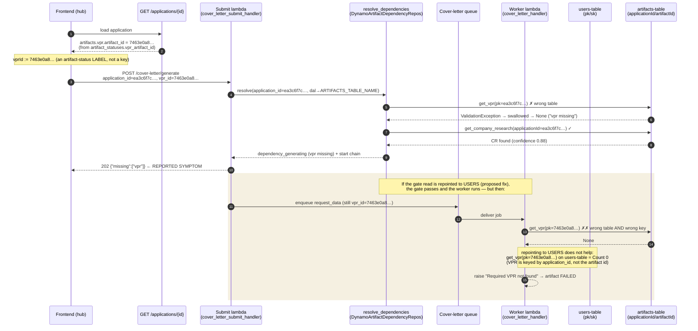

# 01 — Artifact Table Routing & the VPR Identifier Model

> **Status:** Diagnosed, not yet fixed. Captured for the DB redesign.
> **Environment of record:** `dev`, `us-east-1`. Live evidence captured 2026-06-29.
> **Audience:** future Claude, AWS Serverless DB architect, no prior CareerVP context.
> **Scope:** why "downstream" artifacts (cover letter, interview prep) report a missing VPR even
> though the VPR exists, and why a one-line table-repointing fix is insufficient.

---

## 1. TL;DR for the architect

CareerVP generates a chain of AI artifacts per job application:

```
gap_analysis → company_research → vpr → { cv_tailored, cover_letter, interview_prep }
```

When the user requests a **cover letter** or **interview prep**, the backend first checks that the
required upstream artifacts exist (a "dependency gate"), then enqueues an async worker to do the
generation. The reported symptom:

```jsonc
// POST /cover-letter/generate  and  POST /interview-prep/generate
{ "status": "dependency_generating", "generating": ["vpr"], "missing": ["vpr"] }
```

…returned for application `ea3c6f7c-a6c8-441b-998b-b4231d5d96aa` **even though a completed VPR
exists** for it. The gate reports the VPR missing and launches a redundant Step Functions chain.

There are **two independent defects**, and they stack:

1. **Table-routing defect (the gate).** The gate reads the VPR through a DAL pointed at the
   **artifacts table** (`applicationId/artifactId` schema), but the VPR is written to the
   **users table** (`pk/sk` schema). The query throws `ValidationException` ("Query condition
   missed key schema element"), is swallowed, and the VPR is reported missing.

2. **Identifier-model defect (the workers).** Even after repointing the read to the users table,
   the **async workers fetch the VPR by the wrong identifier**: they use `request.vpr_id`, which is
   the VPR's *artifact id* (`7463e0a8…`), while the VPR row is keyed by `application_id`
   (`ea3c6f7c…`). **No VPR row exists under the artifact id on any table.** So the worker's lookup
   fails regardless of which table it targets.

A fix that only addresses #1 (the originally proposed change) makes the gate pass but moves the
failure into the worker, which then raises `Required VPR not found` and marks the artifact
`FAILED`. The user still gets nothing. **This is why the table-routing problem and the identifier
problem must be solved together.**

---

## 2. Live evidence (dev, captured 2026-06-29)

Application under test: `ea3c6f7c-a6c8-441b-998b-b4231d5d96aa`
Owner (`user_id`): `34282458-d091-7085-d844-ca6239acb1af`

**VPR — exists, in the users table, keyed by application_id:**

```
Table: careervp-users-table-dev   (key schema: pk / sk)
  pk         = ea3c6f7c-a6c8-441b-998b-b4231d5d96aa     ← the application_id
  sk         = ARTIFACT#VPR#v1
  user_id    = 34282458-d091-7085-d844-ca6239acb1af     ← matches owner
  created_at = 2026-06-29T05:17:09.752911Z
  (fields: value_proposition, differentiators, executive_summary, metadata, version, …)
  NOTE: there is NO `vpr_id` / `id` attribute on this row. It is addressable only by pk.
```

**VPR — NOT in the artifacts table.** A query of `careervp-artifacts-table-dev` for
`applicationId = ea3c6f7c…` returns exactly one item, and it is the **Company Research**, not the
VPR:

```
Table: careervp-artifacts-table-dev   (key schema: applicationId / artifactId)
  applicationId = ea3c6f7c-a6c8-441b-998b-b4231d5d96aa
  artifactId    = ARTIFACT#COMPANY_RESEARCH#ea3c6f7c-a6c8-441b-998b-b4231d5d96aa
  artifactType  = company_research
  user_id       = 34282458-…    confidence_score = 0.88   company_name = "SysAid3"
```

**Application record — shows the id divergence and a stale chain lock:**

```
Table: careervp-applications-table-dev   (key schema: userId / applicationId)
  userId / applicationId = 34282458-… / ea3c6f7c-…
  artifact_statuses = {
      vpr            : completed,   vpr_artifact_id        : 7463e0a8-0dbb-41aa-92dd-f6be72e0b584
      cv_tailored    : completed,   cv_tailored_artifact_id: cv-tail-5cc78920-…
      company_research: completed,
      cover_letter   : pending,
      interview_prep : pending,
  }
  chain_execution_status = RUNNING                       ← STALE lock (see §8)
  chain_execution_arn    = …:execution:careervp-artifact-chain-statemachine-dev:
                            chain-ea3c6f7c-…-cover_letter-ebd051b6
```

**The smoking gun:** `vpr_artifact_id = 7463e0a8…` but the VPR row's key is `ea3c6f7c…`.
A query of the users table for `pk = 7463e0a8…` returns **Count = 0**. The artifact id is not a
key anywhere. Yet the frontend sends `7463e0a8…` as `vpr_id`, and the workers fetch by it.

---

## 3. The current table landscape (as observed)

| Logical table (env var) | Physical name (dev) | Key schema | Holds | ~Items |
|---|---|---|---|---|
| `USERS_TABLE_NAME` / `TABLE_NAME` / `DYNAMODB_TABLE_NAME`¹ | `careervp-users-table-dev` | `pk` / `sk` | **VPR** (`pk=application_id, sk=ARTIFACT#VPR#v{n}`), tailored-CV artifacts, CV, gap artifacts, legacy single-table data | 906 |
| `ARTIFACTS_TABLE_NAME` | `careervp-artifacts-table-dev` | `applicationId` / `artifactId` | **Company Research** (`applicationId=app, artifactId=ARTIFACT#COMPANY_RESEARCH#app`), cover_letter + interview_prep PENDING/result rows | 219 |
| `APPLICATIONS_TABLE_NAME` | `careervp-applications-table-dev` | `userId` / `applicationId` | application state, `artifact_statuses`, chain lock | 9 |
| `JOBS_TABLE_NAME` / `VPR_JOBS_TABLE_NAME` | `careervp-jobs-table-dev` | `job_id` (== `application_id`) | job posting (title/company/description), VPR job status, `result_key`/`result_url` | 144 |
| `GAP_RESPONSES_TABLE_NAME` | `careervp-gap-responses-table-dev` | `userId` / `questionId` | gap question answers | 16 |
| `CVS_TABLE_NAME` | `careervp-cvs-table-dev` | `userId` / `cvId` | (partially used; CV canonical copy still in users-table) | 4 |

¹ The single physical users-table is exposed under **three different env vars** that resolve to it
in different code paths (`api_db.db` and `api_db.users_table` are the same table). This aliasing is
itself a redesign hazard — see §7.

**Key takeaways for the redesign:**

- There are **at least three mutually-incompatible key schemas** in play
  (`pk/sk`, `applicationId/artifactId`, `job_id`). A query built for one schema throws
  `ValidationException` against another. These exceptions are routinely caught and converted to
  "artifact missing," turning an *infrastructure mismatch* into a *business "not found"* — the
  failure mode is silent.
- "Which table holds artifact X" is **not encoded anywhere as a contract.** It is reconstructed at
  runtime from env-var precedence chains like
  `ARTIFACTS_TABLE_NAME → DYNAMODB_TABLE_NAME → TABLE_NAME`. Two lambdas running the same code can
  resolve to different tables because their env differs.

---

## 4. The artifact dependency model

Pure resolver: [src/backend/careervp/logic/artifact_dependency_resolver.py](../../src/backend/careervp/logic/artifact_dependency_resolver.py)

```python
DEPENDENCIES = {
    'company_research': ('gap_analysis',),
    'vpr':              ('company_research',),
    'cv_tailored':      ('vpr',),
    'cover_letter':     ('vpr', 'company_research'),
    'interview_prep':   ('vpr',),
}
```

The resolver is **pure** (no I/O): handlers pass it a `repos` object implementing
`get_application()` and `get_artifact(type, application_id)`, plus a `start_chain` callback.
For each required upstream it calls `get_artifact`; if any come back `None` / not-owned / stale it
either returns `upstream_required` (HTTP 409, chain disabled) or `dependency_generating`
(HTTP 202, chain enabled → launches Step Functions). If all resolve, it returns `ready` **and the
resolved artifacts** in `resolution.resolved_upstream[type].artifact`.

The DynamoDB adapter that the handlers actually pass in:
[src/backend/careervp/handlers/artifact_dependency_utils.py](../../src/backend/careervp/handlers/artifact_dependency_utils.py)

```python
class DynamoArtifactDependencyRepos:
    def get_artifact(self, artifact_type, application_id):
        if artifact_type == 'vpr':
            result = self._dal.get_vpr(application_id=application_id)   # ← reads self._dal's table
            ...
        if artifact_type == 'company_research':
            load_confident_company_research_artifact(application_id, user_id)  # reads ARTIFACTS_TABLE_NAME
        ...
```

`self._dal` is whatever `DynamoDalHandler` the **submit handler** constructed. That is the crux of
the gate defect: see §6.

`DynamoDalHandler.get_vpr` (the read) queries the **base table**, by `pk`, not a GSI:

```python
# src/backend/careervp/dal/dynamo_dal_handler.py  (get_latest_vpr)
key_condition = Key('pk').eq(application_id) & Key('sk').begins_with('ARTIFACT#VPR#')
response = table.query(KeyConditionExpression=key_condition)   # table = self.table_name
```

So `get_vpr(X)` can only ever succeed when **`X` is the `pk`**, i.e. when `X == application_id`,
**and** the DAL's table is the users-table. Both conditions must hold. In the failing flows,
neither does for the workers, and the table condition fails for the gate.

---

## 5. Lambda topology (who reads what)

Three *separate* lambdas back each downstream artifact. They are **different deployables with
different env**, even when they share a handler module. Defined in
[infra/careervp/api_construct.py](../../infra/careervp/api_construct.py).

### Cover letter

| Role | Handler module | Key env (table routing) | Reads VPR via |
|---|---|---|---|
| **Submit / gate** (`POST /cover-letter/generate`) | `cover_letter_submit_handler` | `ARTIFACTS_TABLE_NAME=artifacts`, `DYNAMODB_TABLE_NAME=artifacts`, `USERS_TABLE_NAME=users` | gate `get_vpr(application_id)` on **artifacts** ✗ |
| **Worker** (SQS) | `cover_letter_handler` | same shared env; `DYNAMODB_TABLE_NAME=artifacts`, `USERS_TABLE_NAME=users`, has `users_table.grant_read_data` | `get_vpr(request.vpr_id)` on **artifacts** ✗✗ |
| **Status** (`GET …/status`) | `cover_letter_handler` | `DYNAMODB_TABLE_NAME=artifacts` | n/a |

### Interview prep

| Role | Handler module | Key env (table routing) | Reads VPR via |
|---|---|---|---|
| **Submit / gate** (`POST /interview-prep/generate`) | `interview_prep_submit_handler` | `ARTIFACTS_TABLE_NAME=artifacts`, `USERS_TABLE_NAME=users` | gate `get_vpr(application_id)` on **artifacts** ✗ |
| **Worker** (SQS) | `interview_prep_handler` | `DYNAMODB_TABLE_NAME=artifacts`, `VPR_JOBS_TABLE_NAME=jobs`, `USERS_TABLE_NAME=users`, **no users-table IAM grant** | jobs-table by `vpr_id`, then `get_vpr(vpr_id)` on **artifacts** ✗✗ |
| **Status** | `interview_prep_handler` | `DYNAMODB_TABLE_NAME=artifacts` | n/a |

`_build_shared_table_env()` (api_construct.py) injects `ARTIFACTS_TABLE_NAME`, `USERS_TABLE_NAME`,
`CVS_TABLE_NAME`, etc. into *every* lambda — so `USERS_TABLE_NAME=users-table` is present
everywhere. The shared `lambda_role` grants `Query/GetItem` on the users-table to the submit
lambdas. **But the interview_prep worker has its own role and was only granted artifacts +
applications + jobs — not users-table.** (Cover_letter worker *was* granted users-table.)

### Contrast: cv_tailored works — and shows the correct pattern

`cv_tailoring_handler` is a **synchronous** lambda whose DAL is `TABLE_NAME = users-table`. Its gate
reads VPR by `application_id` on the users-table → succeeds. Critically, it then **consumes the
gate-resolved VPR** instead of re-fetching:

```python
resolved_vpr_ref = dependency_resolution.resolved_upstream.get('vpr')
resolved_vpr     = resolved_vpr_ref.artifact if resolved_vpr_ref else None
# get_vpr(vpr_id) is only a best-effort fallback, and VPR is optional for cv_tailored
```

`cv_tailored = completed` in the live data **because it never depends on the broken
`vpr_id` re-fetch.** The cover_letter/interview_prep workers throw the resolved VPR away and
re-fetch by `vpr_id` — that is the design divergence that bites.

---

## 6. The request/response chain, in full detail

### 6.0 Sequence overview

The diagram traces a cover-letter request end-to-end. `interview_prep` is identical except its
worker tries the jobs-table first (also keyed by `application_id`, also missed by `vpr_id`). Note
where the two identifiers diverge (`application_id = ea3c6f7c…` vs `vpr_id = 7463e0a8…`) and the two
points marked ✗ where a read resolves the wrong table and/or the wrong key.



### 6.1 Frontend builds the request

`src/frontend/hooks/useApplicationHub.ts`:

```ts
const artifacts = appData?.artifacts;                 // from GET /applications/{id}
const vprId     = artifacts?.vpr?.artifact_id ?? null; // === 7463e0a8…  (the ARTIFACT id)
```

`artifacts.vpr.artifact_id` is built by the backend application handler from `artifact_statuses`:

```python
# src/backend/careervp/handlers/application_handler.py  (_build_artifacts)
'artifact_id': status_map.get(f'{artifact_type}_artifact_id')   # → vpr_artifact_id = 7463e0a8…
```

`src/frontend/hooks/useGenerateModule.ts` then sends:

```ts
// cover letter
api.generateCoverLetter({ application_id: jobId,        // ea3c6f7c…  (the route param)
                          vpr_id:        options.vprId,  // 7463e0a8…  (the artifact id)
                          cv_id, gap_response_ids, company_research_id })
// interview prep
api.generateInterviewPrep({ application_id: jobId,       // ea3c6f7c…
                            vpr_id:         options.vprId, // 7463e0a8…
                            gap_response_ids })
```

**So the request carries two different identifiers for the same application:**
`application_id = ea3c6f7c…` (a key) and `vpr_id = 7463e0a8…` (not a key anywhere).

### 6.2 Submit handler runs the dependency gate

`cover_letter_submit_handler.lambda_handler`:

```python
table_name = _get_artifacts_table_name()      # ARTIFACTS_TABLE_NAME → careervp-artifacts-table-dev
application_id = api_request.application_id or api_request.job_id      # = ea3c6f7c…
resolve_handler_dependencies(
    artifact_type='cover_letter',
    application_id=application_id,             # CORRECT id
    dal=DynamoDalHandler(table_name),          # WRONG table (artifacts)
)
```

Inside the gate, `get_artifact('vpr', ea3c6f7c…)` → `self._dal.get_vpr(application_id=ea3c6f7c…)`
→ `table.query(pk = ea3c6f7c…, …)` against the **artifacts** table whose key is
`applicationId/artifactId`:

```
botocore ClientError (ValidationException):
  "Query condition missed key schema element: applicationId"
```

`get_latest_vpr` catches `ClientError` and returns `Result(success=False)` → `get_artifact`
returns `None` → resolver marks `vpr` **missing**.

- `company_research` resolves correctly here: it reads `ARTIFACTS_TABLE_NAME` with the
  `applicationId/artifactId` key, which **is** the artifacts table — so CR (confidence 0.88, owned)
  is found. The only missing dependency is `vpr`.
- Chain is enabled in dev (`ARTIFACT_CHAIN_ENABLED=true`, `STEP_FUNCTIONS_CHAIN_ARN` set), so the
  resolver returns `dependency_generating` (HTTP 202) and calls `start_chain('vpr', …)`, which
  claims the RUNNING lock and starts the Step Functions execution we see stuck in the live data.

**Response:** `{"status":"dependency_generating","generating":["vpr"],"missing":["vpr"]}`.
This is the reported symptom. The gate has VPR in hand (in the users-table) but cannot see it.

### 6.3 If the gate were fixed — the worker takes over

Suppose we repoint the gate's VPR read to the users-table (the originally proposed fix). The gate
now finds VPR (by `application_id`) and CR → returns `ready` → the submit handler writes a PENDING
artifact row and enqueues an SQS message containing the **original request_data**, i.e. still
`vpr_id = 7463e0a8…`. Then:

**Cover letter worker** — `cover_letter_handler._resolve_vpr_payload`:

```python
vpr_result = dal.get_vpr(api_request.vpr_id)   # dal = _get_dal() = ARTIFACTS table; arg = 7463e0a8…
# → query pk = 7463e0a8 …   →  empty / ValidationException  →  None
raise ValueError(f'Required VPR not found for cover letter: {vpr_id}')
```

Both failure modes apply at once: **wrong table** (artifacts) *and* **wrong key** (`7463e0a8…` is
not a `pk` anywhere). Repointing the worker to the users-table fixes the table but **not** the key —
`get_vpr(7463e0a8…)` on the users-table is still `pk = 7463e0a8…` → Count 0 → `None`. The worker
marks the cover_letter artifact `FAILED` (`stage=context_resolution`).

**Interview prep worker** — `interview_prep_handler._resolve_interview_prep_context`:

```python
vpr_payload = _resolve_vpr_from_jobs_table(api_request.vpr_id, user_id)  # JobsRepository.get_job(7463e0a8…)
#   jobs table is keyed by job_id == application_id == ea3c6f7c…  → get_job(7463e0a8…) = None
vpr_result = dal.get_vpr(api_request.vpr_id)   # fallback, artifacts table, pk = 7463e0a8…  → None
# "A missing VPR is fatal" → worker fails
```

Same root cause: looked up by the artifact id, which is a key on **no** table.

### 6.4 Why this never surfaced as a *worker* error before

Because the **gate** has been failing first (returning 202/redundant chain), the workers for these
two artifacts effectively never ran to the VPR-resolution step on this data. Fixing only the gate
*unmasks* the worker defect. Any redesign validation must exercise the **whole chain to a persisted
result**, not just the gate's HTTP status.

---

## 7. Root cause synthesis

There is no single bug; there is a **missing contract**. Three interacting decisions are unmade:

### 7.1 Storage location is implicit and schema-divergent
- An artifact's home table is chosen by env-var precedence, per-lambda, with no type-level mapping.
- The home tables use **incompatible key schemas**, so a "read from the wrong table" is not a clean
  miss — it is a `ValidationException` that gets swallowed into a false "missing."
- The same physical users-table is aliased by `TABLE_NAME`, `DYNAMODB_TABLE_NAME`, and
  `USERS_TABLE_NAME`, so "point this at the users-table" has several spellings and is easy to get
  subtly wrong (and to half-migrate — see the FE-UI-036 note below).

### 7.2 Identifier model is ambiguous
For one application there are **three ids** in flight:

| Identifier | Example | Where it is a key | Where it is used |
|---|---|---|---|
| `application_id` (== `job_id`) | `ea3c6f7c…` | users-table `pk` (VPR), applications-table `applicationId`, jobs-table `job_id` | the real handle for VPR; what the gate uses |
| `*_artifact_id` (`vpr_artifact_id`) | `7463e0a8…` | **nothing** — it is a status label in `artifact_statuses` | surfaced to the FE as `artifacts.vpr.artifact_id`; sent back as `vpr_id` |
| request field `vpr_id` | `7463e0a8…` | — | what the **workers** fetch by (wrong) |

The VPR row carries **no `vpr_id`/`id` attribute at all** — it is addressable only by
`pk = application_id`. So `vpr_id` can never be a valid lookup handle for it. The system invented an
identifier (`vpr_artifact_id`) that does not correspond to any stored key, exported it to the
client, and then trusted it back as a lookup key.

### 7.3 Lazy, multi-table entity materialization
An application exists as a `jobs-table` row before its `applications-table` row materializes;
ownership/state therefore live in different tables at different lifecycle stages (this caused the
historical 403 incident, and complicates `get_application`/staleness reasoning).

**The defect is structural:** any reader that fetches "the VPR" must agree with the writer on
(a) the table, (b) the key schema, and (c) the *value of the key*. Today nothing enforces agreement
on any of the three.

---

## 8. Secondary findings (must not regress in the redesign)

- **Staleness check is dormant.** `_is_stale` compares VPR `created_at` to application fields
  `gap_responses_updated_at` / `responses_submitted_at` / `gap_responses_submitted_at`. **None of
  these fields is ever written** anywhere in the backend (verified by grep), so `_is_stale` is
  always `False`. If the redesign starts writing any of them, it can flip a freshly-found VPR to
  "stale" → "missing" → regeneration loop. Make staleness an explicit, tested contract or remove it.
- **Stale chain lock.** The live application has `chain_execution_status = RUNNING` from the
  redundant chain the broken gate launched. The resolver checks `ready` **before** the
  `chain_is_running` guard, so once dependencies resolve the lock does not block these two
  artifacts — but the lock is **not** auto-cleared by any fix here, and the in-flight chain may
  double-generate. The redesign needs a deterministic lock lifecycle (claim → set → clear on
  terminal) that cannot strand a RUNNING flag. (Recent patches added a cancel-guard; treat the lock
  as first-class state, not an attribute mutated from several call sites.)
- **Test blind spot.** A global autouse fixture
  (`tests/conftest.py::mock_artifact_dependency_resolver`) patches `resolve_dependencies` to return
  `ready` for *every* handler test. Consequently **no test exercises real VPR/CR table-and-key
  resolution** — the resolver unit tests use a hand-rolled `FakeRepos`, not the Dynamo adapter.
  This whole bug class is invisible to CI. The redesign must add tests that drive real
  `get_artifact`/worker resolution against moto tables with the *actual* key schemas.

---

## 9. Design requirements for the redesign

These are the invariants the new persistence layer should make **structurally true**, so this class
of bug cannot recur:

1. **One artifact, one addressable home, one key.** Define a typed artifact-storage contract:
   `artifact_type → (table, key schema, key value derivation)`. No code should pick a table from an
   env-precedence chain. A reader and writer for the same `artifact_type` must be guaranteed-by-
   construction to resolve the same physical location and key.

2. **Stable, stored, canonical identifiers.** Pick the application-scoped artifact key
   (recommended: `application_id` as the partition for per-application artifacts, with
   `ARTIFACT#<TYPE>#v<n>` as sort) and **store it on the row**. If an `artifact_id` is exported to
   clients, it must be a real, queryable key — or the client must round-trip the `application_id`
   instead. Never accept a client-supplied identifier that is not a stored key.

3. **No silent schema mismatches.** A query against the wrong key schema currently degrades to
   "artifact missing." The new DAL must surface routing/identity errors as *errors*
   (or, better, make them unrepresentable). "Not found" and "wrong table/key" must be
   distinguishable.

4. **Pass resolved upstreams forward; don't re-fetch by a fragile id.** The gate already resolves
   the VPR object. Downstream workers should consume `resolved_upstream` (as `cv_tailored` does), or
   re-resolve by the **same `application_id`** the gate used — never by a separate `vpr_id`.
   For async (SQS) workers, carry the resolved artifact reference (or the `application_id` + version)
   in the message, not an artifact-status label.

5. **Converge the table aliases.** Collapse `TABLE_NAME` / `DYNAMODB_TABLE_NAME` / `USERS_TABLE_NAME`
   to a single named binding per logical store. Today's aliasing is what allowed a half-migration to
   leave readers and writers pointed at different tables.

6. **Make entity materialization explicit.** Decide whether an "application" is the `jobs-table`
   record, the `applications-table` record, or a unified entity, and make ownership/state read from
   one authoritative place across the whole lifecycle. Eliminate the "row exists as a job before it
   exists as an application" ambiguity.

7. **Plan the migration as part of the schema, not after.** A documented future migration
   (FE-UI-036 phase 2) intends to **move VPR (and other stragglers) out of the users-table into the
   artifacts table**. The redesign should define the target home for every artifact up front so the
   move is a data migration, not another round of env-repointing — and so a reader cannot silently
   follow the data to the wrong table mid-migration.

---

## 10. Appendix — the minimal in-place patch (if a stopgap is needed before redesign)

Documented only so the redesign understands what a "complete" patch of the *current* architecture
requires (the originally proposed gate-only repoint is **insufficient**):

- **Gate** (`artifact_dependency_utils.get_artifact('vpr')`): read VPR via a DAL pointed at the
  users-table — prefer a dedicated `VPR_TABLE_NAME` env (default = users-table) over hardcoding, so
  the FE-UI-036 migration is a one-line env flip. Key is already correct (`application_id`).
  *Submit lambdas already have `USERS_TABLE_NAME` + users-table IAM read → code/env only, no IAM.*
- **Cover-letter worker** (`cover_letter_handler._resolve_vpr_payload`): fetch VPR by
  `application_id` (not `vpr_id`) from the users-table. *Env + IAM already present.*
- **Interview-prep worker** (`interview_prep_handler`): resolve VPR by `application_id` against the
  users-table; **add `users_table.grant_read_data` to the worker lambda** → requires `cdk deploy`
  (IAM change).
- **Operational:** clear the stale `chain_execution_status = RUNNING` for `ea3c6f7c…` (and cancel
  the in-flight `chain-ea3c6f7c…-cover_letter` execution).
- **Tests:** add coverage that bypasses the autouse resolver mock and drives real `get_artifact`
  and worker VPR resolution against moto tables with the real key schemas.

The strategically correct fix — and the reason this is in the redesign dossier — is requirement
**#4 + #2**: stop re-fetching the VPR by an artifact-status label, give artifacts a real stored key,
and pass resolved upstreams forward.
