<!--
  CareerVP — Full-Stack Architecture (v2). Supersedes careervparchitecture.md (v1, 2026-06-23).
  Reconciled against `main` @ HEAD 4f7c294 (2026-06-29), 43 commits after v1.
  Evidence: every as-built claim cites path:line in the ymeirovich/careervp repo.
  Companion: redesign-runbook.md (executable migration).
-->

# CareerVP — Full-Stack Architecture: Current State & Redesign (v2)

**Status:** Reconciled against `main` @ `4f7c294` (2026-06-29) · **Audience:** Engineering · **Companion:** [`redesign-runbook.md`](./redesign-runbook.md)
**Supersedes:** `careervparchitecture.md` (v1, 2026-06-23), which was data-layer-only and is now stale on several claims (see §0.4).
**Convention:** every as-built claim cites `path:line`. "Current" = code on `main` at HEAD `4f7c294`.

---

## 0. Front matter

### 0.1 Purpose
A precise, evidence-based record of **how CareerVP is built today across the whole stack** — IaC/stack topology, the data layer, async orchestration, auth/tenancy, security, observability, CI/CD and cost — the **defects and structural risks** in it, and the **target architecture** that resolves them under the eight quality attributes the team asked for: *security, resiliency, hardening, reliability, scaling, availability, performance, flexibility*.

The centre of gravity remains the **serverless data redesign** (single-table `core` item collection), but v2 widens scope: the audit surfaced **infrastructure risks that outrank the data redesign** and that **gate** it — most importantly that the live stateful resources use `RemovalPolicy.DESTROY`, which makes any in-place migration unsafe until fixed.

### 0.2 How to read it
- **§1** — executive summary + reordered risk register.
- **§2** — system context (artifacts + dependency chain).
- **§3** — the as-built record, full-stack, with **per-artifact infrastructure-wiring diagrams** (§3.4).
- **§4** — why it must evolve, mapped to the eight quality attributes.
- **§5** — the target architecture (guardrails → single-table `core` → security/resilience targets).
- **§6** — findings register (severity, evidence, migration phase).
- **§7** — sequenced plan (maps 1:1 to the runbook).
- **§8** — decisions, open questions, deferred tracks (compression, RAG).

### 0.3 Glossary
| Term | Meaning |
|---|---|
| `users` table / `db` | The **same physical table** — `api_db_construct.py:79` sets `self.db = self.users_table`. |
| Canonical key | Key shape `applicationId` / `artifactId` (artifacts table). |
| Legacy key | Key shape `pk` / `sk` (users table). |
| `application_id` | The real per-application handle; **== `job_id`**. The VPR row's `pk`. |
| `*_artifact_id` | A **status label** in `applications.artifact_statuses`; **not a key on any table** (see §3.3). |
| Item collection | Multiple related items sharing a partition key, ranged by sort key — "get parent + children in one Query". |
| Single-table design | One table holding many entity types via overloaded, generic keys. |
| Artifact | A generated output: Base CV, Gap Analysis, Company Research, VPR, Tailored CV, Cover Letter, Interview Prep, AI Assist. |
| Nested stack | A `NestedStack` that appears in its parent as one `AWS::CloudFormation::Stack` resource — used to stay under the 500-resource limit. |

### 0.4 What changed since v1 (2026-06-23 → 2026-06-29, 43 commits)
42 of the 43 commits are squashed into one merge, `cbf3253` ("Merge ui-upgrade #218"); the rest are CI/cancel-race fixes and the cost-model doc (`4f7c294`).

**Defect status delta vs v1:**

| v1 defect | Status now | Note |
|---|---|---|
| AI Assist VPR context always empty (`save_vpr` "dead") | ✅ **FIXED** | `save_vpr` runs in the live async VPR worker; AI-Assist reads the same `pk=application_id, sk=ARTIFACT#VPR#v*` on the users table (`ai_assist_handler.py:340`, `dynamo_dal_handler.py:319-381`). |
| `company-research-cache` table dead | ✅ **FIXED** | Now read/written by `logic/company_intel_cache.py` (split-TTL profile/news cache). |
| Interview Prep "stuck pending" (poll misses completed row) | 🟡 **DOWNGRADED** | Poll resolves — the worker updates the `job_id`-keyed row to COMPLETED with the result (`interview_prep_handler.py:313-319`). A redundant `prep_id`-keyed **orphan row** is still written (`:968-991`) → MEDIUM hygiene, not a functional bug. |
| TTL attribute-name mismatch | ❌ **REMAINS** | CV-tailored writes attr `ttl` to a table whose TTL key is `expiration`; cover letters write no TTL field at all → both never expire. |
| `userEmail` partition key in `knowledge` (mutable PII) | ❌ **REMAINS** + regressed | Still `PK=userEmail` (`api_db_construct.py:344`); commit `4483b3e` dropped the table from the company-research probe list because querying it threw `ValidationException` — the schema mismatch was worked around, not fixed. |

**Major new structure since v1:** a Step Functions **artifact chain** (`artifact_chain_construct.py`), a company-research SQS worker + failure/cleanup handlers, **four nested stacks** (monitoring, ai-assist, error-report, company-research), ownership-bypass fixes on the VPR/cover-letter/interview-prep workers, **Tavily** replacing DuckDuckGo, and **system-prompt caching** on VPR phase-2 / CV-tailoring / AI-Assist.

**v1 factual corrections:** there are **9** tables in `api_db_construct.py` (not 10); `llm-cache` is defined in `api_construct.py:453`. The `users` and `applications` tables have **no TTL attribute at all**.

---

## 1. Executive summary

CareerVP is an AWS serverless application (CDK Python · API Gateway REST · Lambda + Powertools · DynamoDB · S3 · SQS · Step Functions · Cognito · WAF · Next.js/Amplify) that turns a CV + a job posting into a chain of AI-generated artifacts. Per the repo cost model it runs at a **stable ~88% gross margin**, AI-cost-dominated (VPR ≈ 74% of per-application AI spend); AWS infra is rounding-error by comparison.

The application mostly works, but it works by **careful per-Lambda bookkeeping, not by design**, and it sits on **infrastructure defaults that are unsafe for a redesign**. The two findings that reorder everything:

1. **Data is one `cdk destroy`/stack-replacement away from deletion.** Every live table and bucket uses `RemovalPolicy.DESTROY` with no `deletion_protection`, and the CV bucket has `auto_delete_objects=True` (`api_db_construct.py:101-670,165`). The dedicated `DynamoDBStack`/`S3Stack` files that *correctly* use `RETAIN` are **dead code** — never instantiated in `app.py`. **You cannot safely run a key-schema migration on tables that CloudFormation is allowed to replace.** This must be fixed in Phase 0, before anything else.
2. **The parent `ServiceStack` is at the CloudFormation 500-resource ceiling** (~400–550 resources), kept viable only by the four existing nested stacks. There is no headroom to add the redesign's resources without first decomposing further.

**Top risks (full register in §6), reordered for v2:**

| # | Risk | Severity | Pillar |
|---|---|---|---|
| 1 | Stateful tables/buckets use `RemovalPolicy.DESTROY`, no deletion protection; dedicated stateful stacks are dead code → data-loss on replace, and **migration is unsafe**. | CRITICAL | Reliability |
| 2 | Auth bypass: identity falls back to a client-supplied `x-user-id` header when JWT claims are absent (`auth_utils.py:44-47`). | CRITICAL | Security |
| 3 | Billing/money path has **no idempotency** (`@idempotent` used in zero handlers); Stripe webhook retries can double-charge. | CRITICAL | Reliability |
| 4 | Three SQS workers return `200` instead of `batchItemFailures` → silent message loss; only the CR worker is correct. | CRITICAL | Reliability |
| 5 | SQS visibility timeout == Lambda timeout (1×) on all AI workers → duplicate delivery while still processing → duplicate AI spend. | CRITICAL | Reliability/Cost |
| 6 | Wildcard `resources=["*"]` on KMS and AppConfig in the shared role (`api_construct.py:778,516`); one shared role across 13+ Lambdas. | CRITICAL/HIGH | Security |
| 7 | No single source of truth for artifacts: **3 incompatible key schemas + 3 ids**, table chosen by env-var precedence; a wrong-table read throws `ValidationException` that is swallowed into a false "not found". | HIGH | Flexibility |
| 8 | `ServiceStack` at the 500-resource limit; no concurrency caps on AI workers; WAF dev-disabled; CV bucket CORS `*` + unversioned; x86 (not ARM64); TTL never-expire bug. | HIGH/MED | Scaling/Cost |
| 9 | Tenant isolation is code-level only; mutable PII (`userEmail`) is a partition key; IDOR-prone `get_job` (mitigated only by caller discipline). | HIGH | Security |
| 10 | Cross-table fan-out to render one application → latency/cost; the original driver of the data redesign. | MEDIUM | Performance |

**The redesign in three sentences.** First make the system *safe to change* — flip stateful resources to `RETAIN` + `deletion_protection`, wire the dedicated stateful stack, and decompose the parent stack — then close the CRITICAL security/reliability gaps additively. Only then collapse the per-application artifact graph into a **single-table `core` item collection** keyed `PK=USER#{user_id}`, `SK=APP#{app_id}#{ARTIFACT}`, so an entire application loads in one `Query`, artifacts have one typed home and one stored key, and status transitions are atomic — large bodies (VPR, CV files) stay in S3 and genuinely-independent data (idempotency, async job state, the shared company-research cache) stays in focused tables. Migration is **expand → dual-write → backfill → dual-read → contract**, fully reversible, per the runbook.

---

## 2. System context

### 2.1 Artifacts and their dependency chain
`logic/artifact_dependency_resolver.py`:

```
gap_analysis → company_research → vpr → { cv_tailored, cover_letter, interview_prep }
```

- **Base CV** — parsed from an upload; the root input. Haiku (parse only).
- **Gap Analysis** — Sonnet; questions about gaps between CV and job, then user responses.
- **Company Research** — Haiku + Tavily; async; public company facts (confidence-gated ≥ 0.85 at persist).
- **VPR (Value Proposition Report)** — Sonnet, 6-stage pipeline; the strategic centrepiece; async (SQS worker). Dominant cost (~74%).
- **Tailored CV / Cover Letter / Interview Prep** — Haiku; derived from VPR (+ research, gap responses).
- **AI Assist** — Haiku; read-only field-level rewrite that resolves upstream context server-side.

### 2.2 How it's wired — top level

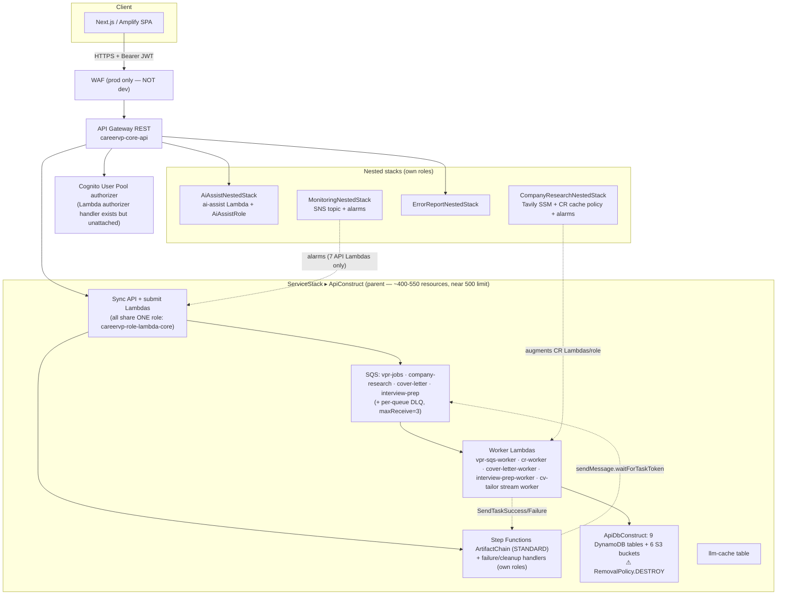

> **Reads in one sentence:** every API and submit Lambda shares a **single IAM role** that can touch nearly every table, queue and bucket; WAF is **off in dev**; the **stateful resources live inside the high-churn parent stack with a `DESTROY` policy**; and the four nested stacks are the only thing keeping the parent under the 500-resource hard limit.

---

## 3. Current architecture — the as-built record

### 3.1 Stack & resource topology

| Stack / construct | Lifecycle | Holds | Removal policy |
|---|---|---|---|
| `ServiceStack` (parent) | high-churn | AppConfig, Cognito, **ApiConstruct** (REST API, all API/worker Lambdas, all SQS, Step Functions chain, billing, export, **ApiDbConstruct**) | — |
| ↳ `ApiDbConstruct` (inside parent) | **stateful, but inside churn stack** | 9 DynamoDB tables + 6 S3 buckets | ⚠ `DESTROY`, no `deletion_protection`, CV bucket `auto_delete_objects=True` (`api_db_construct.py:101-670,165`) |
| `MonitoringNestedStack` | per-feature | SNS topic + alarms (reuses topic from ApiConstruct) | — |
| `AiAssistNestedStack` | per-feature | ai-assist Lambda + **dedicated role** | — |
| `ErrorReportNestedStack` | per-feature | error-report Lambda + dedicated role | — |
| `CompanyResearchNestedStack` | per-feature (additive) | Tavily SSM env + CR-cache policy + alarms appended onto ApiConstruct Lambdas/role | — |
| `DynamoDBStack` / `S3Stack` | **DEAD CODE** | correctly use `RETAIN` but **never instantiated in `app.py`** | `RETAIN` (unused) |
| `FrontendStack` | edge | Next.js/Amplify, CloudFront | — |

**The two structural problems:**
- **Stateful-in-churn-stack with `DESTROY`.** The real data resources sit in the most-frequently-deployed stack, under a removal policy that lets CloudFormation delete them on replacement. This is finding #1 and the reason §5.1 (guardrails) must precede the data migration.
- **500-resource ceiling.** Each Lambda ≈ 5 CFN resources (function + role/policy + log group + version + permission). With ~31 functions, 11 queues, 9 tables, 6 buckets, the REST API surface, WAF and the Step Functions chain, the parent template is estimated at **400–550 resources**. The team already moved four feature areas to nested stacks specifically "to keep the near-limit parent stack lean" (`service_stack.py:104-106`). Adding the redesign's resources directly to `ApiConstruct` risks a hard synth/deploy failure.

### 3.2 Storage inventory

All DynamoDB tables `PAY_PER_REQUEST` (on-demand), **PITR enabled**, but **`RemovalPolicy.DESTROY`**. Defined in `api_db_construct.py` except `llm-cache` (`api_construct.py:453`).

#### DynamoDB tables (9 in `api_db_construct.py` + `llm-cache`)

| # | Table | PK / SK | GSIs | TTL attr | Stream | Holds today |
|---|---|---|---|---|---|---|
| 1 | **`users`** (`db`) | `pk` / `sk` | `email-index`, `user_id-index`(+sk) | **none** | no | `PROFILE`, `SUBSCRIPTION#CURRENT`, **Base CV** (`CV#`), **Gap Questions** (`GAP_ANALYSIS#…`), **Tailored CV** (`ARTIFACT#CV_TAILORED#…`), **VPR** (`ARTIFACT#VPR#v{n}`) |
| 2 | **`artifacts`** | `applicationId` / `artifactId` | `type-index` | `expiration` | **NEW_AND_OLD** | **Company Research**, **Cover Letter**, **Interview Prep** |
| 3 | **`gap-responses`** | `userId` / `questionId` | — | `expiration` | no | Gap Responses |
| 4 | **`knowledge`** | **`userEmail`** / `knowledgeType` | `entity-index` | `expiration` | no | Legacy fallback; **PII partition key**; effectively unused live (probe removed in `4483b3e`) |
| 5 | **`jobs`** | `job_id` (==`application_id`) / — | `idempotency-key-index`, `user_id-index` | `ttl` | **NEW_AND_OLD** | Job posting + VPR async job state (status, `result_key`, presigned URL) |
| 6 | **`applications`** | `userId` / `applicationId` | `status-index` | **none** | no | Workflow state + `artifact_statuses` map + chain lock |
| 7 | **`cvs`** | `userId` / `cvId` | — | `expiration` | no | Base CV (second metadata copy) |
| 8 | **`company-research-cache`** | `cacheKey` / — | — | `expiresAt` | no | Split-TTL company-intel cache (**now in use**) |
| 9 | **`idempotency`** | `id` / — | — | `expiration` | no | Powertools idempotency store (**but `@idempotent` is wired to zero handlers**) |
| 10 | **`llm-cache`** | `cache_key` / — | — | `expires_at` | no | Cached LLM responses (defined in `api_construct.py:453`) |

**Carry-forward facts:**
- `users` (#1) and `applications` (#6) have **no TTL attribute**. Anything written to `users` with a `ttl` field (Tailored CV) never expires.
- `artifacts` (#2) expires on `expiration`; writers that set `ttl` don't expire (cover letter sets *no* TTL field at all).
- **VPR lives in the `users` table** (`pk=application_id, sk=ARTIFACT#VPR#v{n}`) **and** as a body in S3 `vpr-results` + job state in `jobs` — three places.
- The same physical `users` table is aliased by `TABLE_NAME`, `DYNAMODB_TABLE_NAME`, and `USERS_TABLE_NAME` in different code paths — a half-migration hazard.

#### S3 buckets (6)

| Bucket | Purpose | Versioning | Notable |
|---|---|---|---|
| `cv` | uploaded CV source files | **off** | **CORS `*`** (PUT/POST/GET), `auto_delete_objects=True`, `DESTROY`; 7d→Glacier→30d expire |
| `vpr-results` | VPR report bodies (JSON) | on | CORS GET; 365d lifecycle; presigned GET **604800s (7d)** by worker, 3600s by status handler |
| `artifacts` | generated artifact bodies + DOCX exports | on | IA/Glacier tiering |
| `static`, `backups`, `logs` | misc | on/off | Block-public, SSE-S3, TLS-enforced |

### 3.3 Data model — the three-schema / three-id problem (root cause)

The repo's own dossier (`docs/db-redesign/01-artifact-table-routing-and-vpr-id-model.md`) diagnoses this precisely; this section summarizes it because it is the heart of the data redesign.

**Three mutually-incompatible key schemas coexist:** `pk/sk` (users), `applicationId/artifactId` (artifacts), `job_id` (jobs). Which table a Lambda reads is decided by **env-var precedence** (`ARTIFACTS_TABLE_NAME → DYNAMODB_TABLE_NAME → TABLE_NAME`), not by a typed contract — so a reader and its writer can resolve to **different physical tables**, and a query against the wrong schema throws `ValidationException` that is caught and converted into a silent "artifact missing."

**Three identifiers for one application:**

| Identifier | Example | Is a key on… | Used by |
|---|---|---|---|
| `application_id` (== `job_id`) | `ea3c6f7c…` | users `pk` (VPR), applications `applicationId`, jobs `job_id` | the gate; the real handle |
| `*_artifact_id` (`vpr_artifact_id`) | `7463e0a8…` | **nothing** — a label in `artifact_statuses` | surfaced to the FE as `artifacts.vpr.artifact_id` |
| request `vpr_id` | `7463e0a8…` | — | what some workers fetch by (wrong) |

The VPR row carries **no `vpr_id`/`id` attribute** — it is addressable only by `pk=application_id`. The system invented an identifier, exported it to the client, and trusted it back as a lookup key. The `cv_tailored` path works precisely because it **consumes the gate-resolved VPR** instead of re-fetching by the fragile id — the pattern the redesign generalizes.

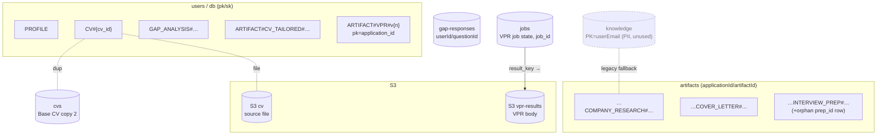

### 3.4 Per-artifact infrastructure wiring

> Notation: solid arrow = data/control flow; `W`/`R` = DynamoDB write/read; dashed = task-token / async signal. All Lambdas use the **shared role** unless noted. Physical names drop the `careervp-…-{env}` wrapper for legibility.

#### 3.4.1 Base CV upload

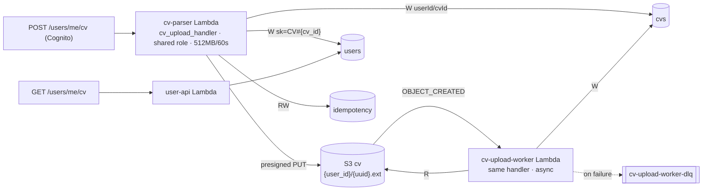
*Note: an SQS `cv-upload-queue`/`dlq` is defined (`api_db_construct.py:63-71`) but **not wired** — the live trigger is the S3 event.*

#### 3.4.2 Gap Analysis (sync)

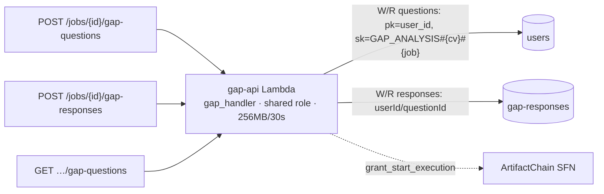
*The `gap-analysis-queue` exists but has no consumer; gap is fully synchronous.*

#### 3.4.3 Company Research (async + Tavily + cache)

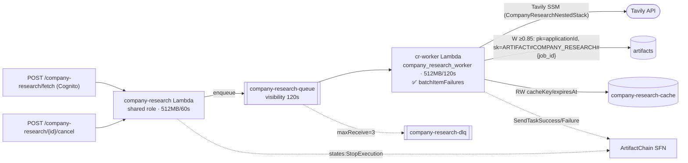

#### 3.4.4 VPR (two workers + DLQ handler)

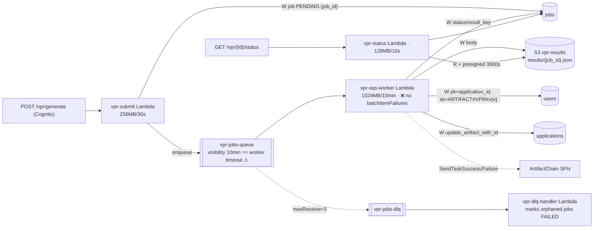
*A second `vpr-worker` Lambda (recovery/chain target, same handler) has explicit per-resource grants — the correct least-privilege pattern, in contrast to the shared-role workers.*

#### 3.4.5 CV Tailoring (sync API + stream worker + chain sync-invoke)

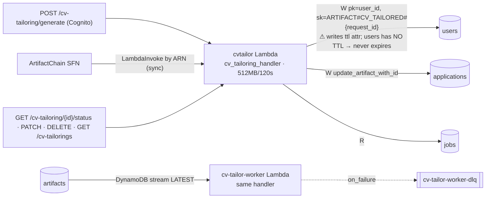

#### 3.4.6 Cover Letter (async)

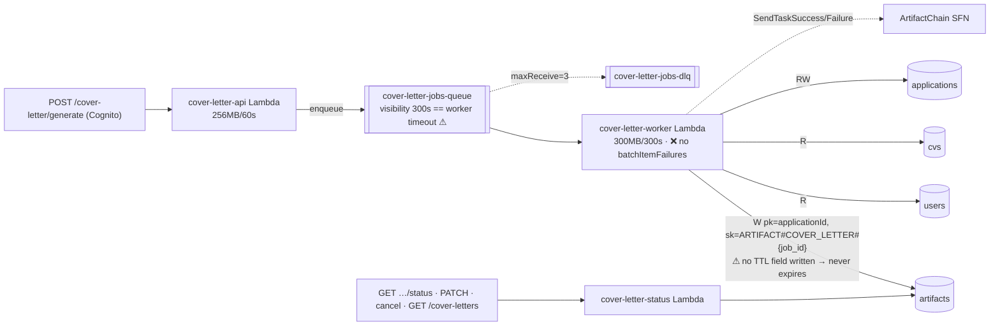

#### 3.4.7 Interview Prep (async)

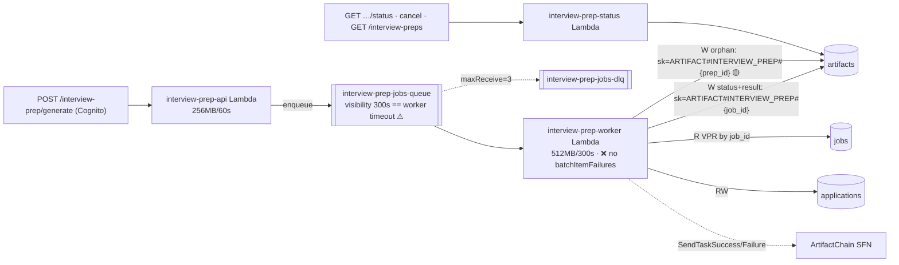

#### 3.4.8 AI Assist (sync, read-only, own role)

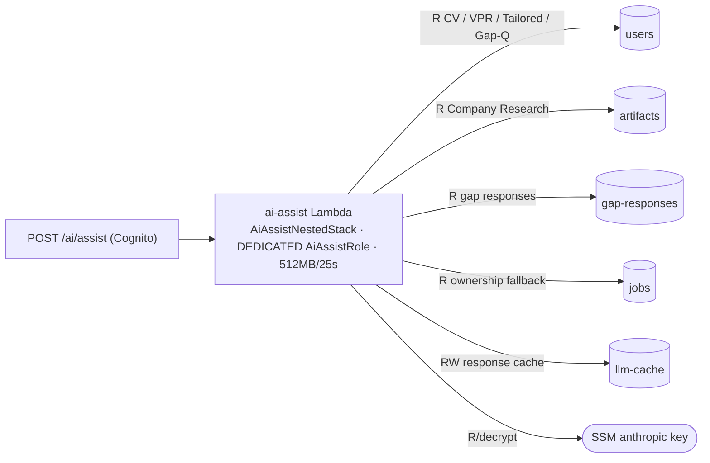
*This is the **single-table direction in embryo**: AI-Assist deliberately points `ARTIFACTS_TABLE_NAME`/`VPR_TABLE_NAME`/`CVS_TABLE_NAME` at the `users` table because that's where those artifacts actually live (`ai_assist_nested_stack.py:80-104`).*

#### 3.4.9 Step Functions artifact chain (orchestration)

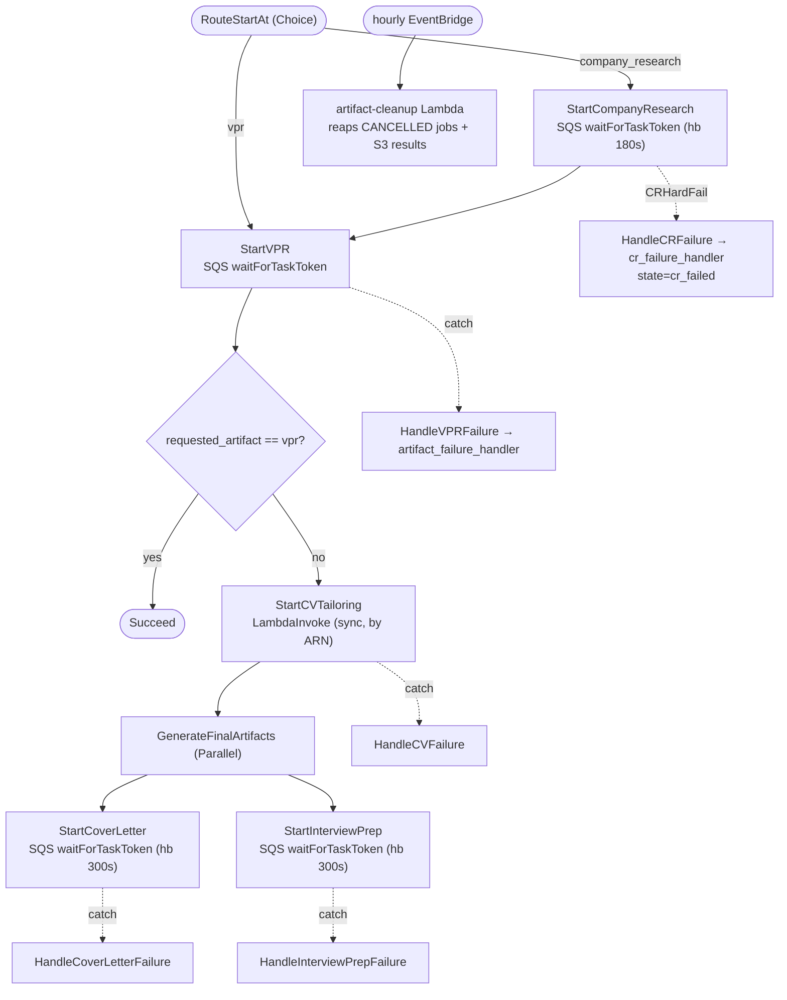
*Failure handlers use a dedicated `FailureHandlerRole` with **no `states:*`** (applications RW only) to break a CFN dependency cycle — a good least-privilege example. CV-tailoring is the only **synchronous** step.*

### 3.5 Auth & tenant model
- **Dual auth.** A Cognito User Pool authorizer (`api_construct.py:446`) plus a self-managed RS256 JWT system (`auth_service.py`) verified in-handler. A Lambda-authorizer **handler** exists (`api_gateway_authorizer.py`) but is **never attached**.
- **Public routes:** `/health`, `/auth/*` (the whole proxy is `authorized=False`), `/billing/webhook`, `/errors`, `/swagger*`. Everything else is Cognito-authorized.
- **CRITICAL bypass:** `extract_user_id()` prefers JWT claims but **falls back to a client `x-user-id` header** (`auth_utils.py:44-47`).
- **IDOR surface:** `jobs_repository.get_job(job_id)` fetches by id with no `user_id` constraint (`jobs_repository.py:196-223`); safe only because every current caller checks ownership post-fetch.
- Cognito password policy allows no-symbol, min-8; MFA not enabled (`cognito_construct.py:22-28`).

### 3.6 Security & hardening
- **One shared IAM role across 13+ Lambdas** (`api_construct.py:70-87,482-819`) — every API Lambda can touch nearly every table/bucket/queue. Workers mostly use dedicated roles + `grant_*` (good).
- **Wildcards:** `kms:Decrypt/GenerateDataKey` and AppConfig actions on `resources=["*"]` (`api_construct.py:778,516`).
- **WAF dev-disabled** (`api_construct.py:240-248`) — only attached in prod.
- **Secrets:** ✅ all in SSM SecureString, resolved at runtime; no secrets in code/env/frontend.
- **CORS:** API GW and gateway error responses emit `Access-Control-Allow-Origin: *` (no credentials, Bearer-header auth, so MEDIUM); CV bucket CORS `*`.

### 3.7 Observability
- ✅ Powertools logger/metrics/tracer; per-Lambda `DynamoValidationException` alarms; API 5xx + p90 latency alarms → KMS-encrypted SNS topic.
- ⚠ **Monitoring covers only 7 API Lambdas** (`service_stack.py:72-80`); **AI/SQS workers and DLQ-depth alarms are not monitored** — a stuck DLQ is silent.
- ⚠ Log retention is **1 day** (short for forensics); likely inverted `_build_dashboard_factory` (`monitoring.py:214-217`).

### 3.8 CI/CD
- ✅ OIDC everywhere (no long-lived keys); strong PR gating (ruff, mypy, pytest, cdk synth, Checkov, Bandit, pip-audit, CodeQL, naming guard).
- ⚠ **No secret scanning** (gitleaks/trufflehog); **no Lambda canary/alias traffic shifting** (all-at-once deploys, no automated rollback); frontend "rollback" only logs.
- ⚠ **CI green is partly notional:** an autouse fixture (`tests/conftest.py::mock_artifact_dependency_resolver`) stubs dependency resolution to `ready` for every handler test, hiding the entire table-routing defect class from CI.

### 3.9 Cost posture (from `docs/cost-model/cost-model.md`)
- **~$0.43/application** AI cost; **VPR ≈ 74%** (Sonnet 6-stage, output-token dominated). **~88% gross margin, flat 100→10,000 users.**
- AWS infra is trivial; **WAF ($5/mo) is the largest fixed cost** at low scale.
- All 31+ Lambdas are **x86_64** (no Graviton). Power-user risk: 20–30 apps/user/mo compresses margin to 35–57%. Hebrew ≈ 2× tokens.

---

## 4. Why it must evolve — mapped to the eight quality attributes

| Attribute | Current gap | Evidence |
|---|---|---|
| **Security** | Auth bypass header; wildcard IAM; one shared role; WAF dev-only; PII partition key; IDOR surface. | §3.5, §3.6 |
| **Resiliency** | 3 workers drop failed messages; visibility==timeout; no DLQ-depth alarms. | §3.4, §3.7 |
| **Hardening** | No idempotency on billing; secret scanning absent; CORS `*`. | §3.6, §3.8 |
| **Reliability** | Stateful `DESTROY`; no canary/rollback; stale chain lock; orphan rows. | §3.1, §3.8 |
| **Scaling** | 500-resource ceiling; no concurrency caps → AI-provider stampede. | §3.1, §3.4 |
| **Availability** | All-at-once deploys; single shared role = wide blast radius. | §3.6, §3.8 |
| **Performance** | Cross-table fan-out to render one application; multi-place VPR. | §3.3 |
| **Flexibility** | 3 key schemas + 3 ids + env-var routing → adding/locating an artifact is bespoke each time. | §3.3 |

---

## 5. Target architecture

### 5.1 Guardrails first (Phase 0 — prerequisite for everything)
1. **Flip all stateful resources to `RemovalPolicy.RETAIN` + `deletion_protection=True`**, remove `auto_delete_objects` on the CV bucket. (Additive; no data change.)
2. **Wire the dead `DynamoDBStack`/`S3Stack`** (or a single `StatefulStack`) and move `ApiDbConstruct`'s tables/buckets into it as a **top-level** stack, so a compute redeploy can never replace data and the parent stack sheds resources.
3. **Decompose the parent further into nested stacks** by feature so no template approaches ~400 resources; add a CI resource-count gate.
4. **Confirm PITR + on-demand backups** before any migration step.

> Until these land, the expand-contract migration in §5.2 is **unsafe** — a key-schema change forces table replacement, and under `DESTROY` that means data loss.

### 5.2 The single-table `core` model
Collapse the per-application artifact graph into one item collection. Keep `users`/`idempotency`/`jobs`(async state)/`company-research-cache`/`llm-cache` as focused tables.

```
PK = USER#{user_id}                          (immutable Cognito sub — NOT email)
SK = APP#{app_id}#PROFILE | #GAP | #CR | #VPR#v{n} | #CV_TAILORED | #COVER | #INTERVIEW | #STATUS
GSI1 (status):  GSI1PK = USER#{user_id}      GSI1SK = STATUS#{state}#{app_id}
Large bodies (VPR JSON, CV files, exports) stay in S3 with a pointer attribute.
```

**Properties this buys:**
- **One `Query`** loads an entire application (`PK=USER#{uid}` + `SK begins_with APP#{app_id}#`) → kills the fan-out (Performance).
- **One typed home + one stored key per artifact** → eliminates the 3-schema/3-id class structurally (Flexibility), satisfying the repo dossier's §9 requirements.
- **Atomic status transitions** via `TransactWriteItems` on one partition.
- **Immutable tenant id leads the PK** → stronger isolation than `userEmail` (Security).

**Typed artifact-storage contract** (dossier §9.1): a single map `artifact_type → (table, key derivation)` that both reader and writer import — no env-var precedence. A `CoreRepository` is the only key-builder; readers re-resolve by `application_id` or consume the gate-resolved upstream — **never** re-fetch by a client-supplied `*_artifact_id`.

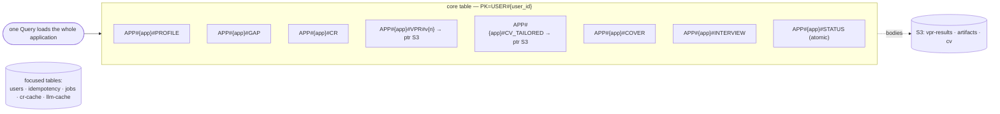

### 5.3 Security & resilience targets (Phases 1–2, additive)
- **Identity from validated JWT only** — delete the `x-user-id` fallback; enforce the partition key in the DAL (kills IDOR).
- **`@idempotent` on billing + AI-cost handlers**, keyed by Stripe event id / business key.
- **Per-Lambda least-privilege roles**; scope KMS/AppConfig to ARNs; split the shared role.
- **`ReportBatchItemFailures` on all SQS workers**; **visibility timeout ≥ 6× Lambda timeout**; **`max_concurrency` (3–5)** on AI workers; **DLQ-depth alarms** + worker coverage in monitoring.
- **WAF in all environments** (or document the dev trade-off); **canary/alias traffic shifting** with auto-rollback.

### 5.4 Deferred / parallel tracks
- **Artifact compression** — *not folded in.* The digest/project-lean pattern is already built in 4/5 steps (`build_vpr_digest`, `build_cv_digest`, `CVSummarizer`); the cost driver is VPR **output** tokens, not input bloat. Track two cheap, pre-scoped items separately: (a) migrate Gap/Cover-Letter/Interview-Prep to `complete(use_system_cache=True)`; (b) truncate Company Research's raw Tavily content (the one measured 15k-token input). Neither needs the redesign.
- **RAG / vectors** — *deferred (out of scope now).* Additive new nested stack + S3 Vectors if/when a curated corpus exists; never the system of record. See `ragvectoranalysis.md`.

---

## 6. Findings register

| # | Sev | Domain | Finding | Evidence | Phase |
|---|---|---|---|---|---|
| 1 | CRITICAL | IaC | Stateful resources `DESTROY` + no deletion protection; dedicated stateful stacks dead | `api_db_construct.py:101-670,165`; `app.py` | 0 |
| 2 | CRITICAL | Auth | `x-user-id` header identity fallback | `auth_utils.py:44-47` | 1 |
| 3 | CRITICAL | Reliability | No `@idempotent` on billing/money path | `billing_reconcile_handler.py` | 1 |
| 4 | CRITICAL | Reliability | 3 SQS workers return 200 not `batchItemFailures` | `vpr_worker_handler.py:619`, `cover_letter_handler.py:487`, `interview_prep_handler.py:151` | 2 |
| 5 | CRITICAL | Reliability | SQS visibility == Lambda timeout (1×) | `api_construct.py:1039/1286,1080/1575,1111/1647` | 2 |
| 6 | CRITICAL | IAM | Wildcard `resources=["*"]` on KMS + AppConfig | `api_construct.py:778,516` | 1 |
| 7 | HIGH | IaC | ServiceStack ~400-550 resources, near 500 limit | `api_construct.py` (~2914 lines) | 0 |
| 8 | HIGH | IAM | One shared role across 13+ Lambdas | `api_construct.py:70-87,482-819` | 1 |
| 9 | HIGH | Data | 3 key schemas + 3 ids, env-var routing, swallowed `ValidationException` | `docs/db-redesign/01-…md`; `dynamo_dal_handler.py` | 3 |
| 10 | HIGH | Reliability | No `max_concurrency` on AI workers (Anthropic stampede) | infra (grep empty) | 2 |
| 11 | HIGH | Auth | IDOR-prone `get_job` (caller-mitigated) | `jobs_repository.py:196-223` | 1 |
| 12 | HIGH | Security | `userEmail` PII partition key; worked-around `ValidationException` | `api_db_construct.py:344`; `4483b3e` | 3 |
| 13 | HIGH | S3 | CV bucket CORS `*`, unversioned, `auto_delete_objects` | `api_db_construct.py:164-191` | 0/1 |
| 14 | MEDIUM | Reliability | TTL never-expire (CV-tailored `ttl`; cover-letter none) | `cv_tailoring_handler.py:467,517`; `cover_letter_handler.py:653-691` | 3 |
| 15 | MEDIUM | Data | Interview-prep orphan `prep_id` row | `interview_prep_handler.py:968-991` | 3 |
| 16 | MEDIUM | Observability | Workers + DLQ depth unmonitored; 1-day log retention | `service_stack.py:72-80`; `monitoring.py` | 2/5 |
| 17 | MEDIUM | CI/CD | No secret scanning; no canary/rollback; autouse fixture hides defects | `.github/`; `tests/conftest.py` | 1/2 |
| 18 | MEDIUM | Cost | x86 not ARM64; Tavily input bloat; cache-migration opportunity | cost-model.md | 5 |
| 19 | MEDIUM | Performance | Cross-table fan-out per application | §3.3 | 3 |
| 20 | LOW | Security | WAF dev-disabled; Cognito no MFA, weak password policy | `api_construct.py:240`; `cognito_construct.py:22` | 1/5 |

---

## 7. Sequenced redesign plan (→ runbook)

```
Phase 0  Guardrails & headroom (NO user-facing change):
         RETAIN + deletion_protection on all stateful; wire StatefulStack top-level;
         decompose parent into nested stacks; CI resource-count gate (<400); confirm PITR + backups.
Phase 1  CRITICAL security via additive deploys + canary: remove x-user-id fallback; @idempotent on
         billing; scope KMS/AppConfig ARNs + split shared role; lock CV bucket CORS/versioning; WAF on.
Phase 2  Reliability hardening (additive): batchItemFailures on all workers; visibility ≥6×; max_concurrency
         on AI workers; DLQ-depth + worker alarms; canary/alias rollback in CI.
Phase 3  DynamoDB single-table `core` via Expand→Dual-write→Backfill→Dual-read→Contract; typed storage
         contract + CoreRepository; converge table aliases; fix TTL, orphan rows, PII key. Per-cohort canary.
Phase 4  API/compute modernization behind versioned routes; collapse remaining {proxy+}; retire old after bake.
Phase 5  Cost & observability: ARM64; prompt-cache migration; Tavily truncation; SLOs; dashboards; log retention.
Each phase independently shippable, independently reversible, gated by metrics before the next.
```

---

## 8. Decisions & open questions

**Decisions taken in v2:**
- Tenant partition key = **Cognito `sub` (`user_id`)**, never `email` (resolves the v1↔rubric contradiction).
- **Guardrails (Phase 0) precede the data migration** — non-negotiable given `DESTROY`.
- Compression and RAG are **deferred parallel tracks**, not part of the `core` schema.

**Open questions:**
1. Confirm the live env resolution of `cv_tailoring`'s write target — `pk/sk` written to a `userId/cvId`-keyed `cvs` table would raise `ValidationException` (needs runtime confirmation).
2. Staleness contract: `_is_stale` compares fields that are **never written** (dossier §8). Make it explicit-and-tested or remove it before it triggers regeneration loops.
3. Chain lock lifecycle: model `chain_execution_status` as first-class state (claim → set → clear on terminal); a stale `RUNNING` is observed in dev.
4. Should `jobs` and `applications` be unified, or does `core` subsume both? (Entity-materialization ambiguity, dossier §9.6.)

---

*v2 reconciled against `main` @ `4f7c294`. Companion execution detail in [`redesign-runbook.md`](./redesign-runbook.md).*
