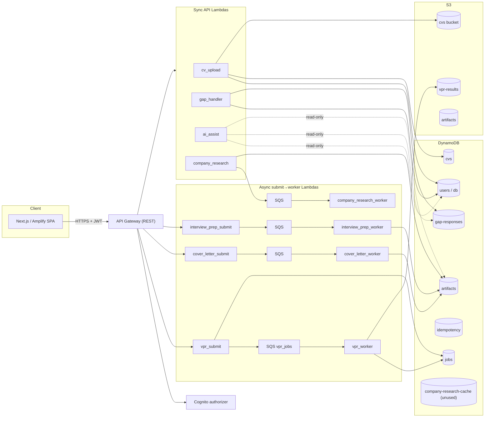
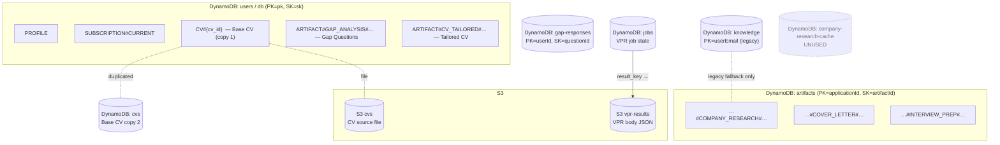

<!--
  DRAFT — built section-by-section. Status: §0–§2, §3.1, §3.2 drafted; §3.3+ pending review.
  Audience: engineering. Weight: current-state ("as-built") record. Standalone; references the redesign runbook.
-->

# CareerVP — Architecture: Current State & Redesign

**Status:** Draft (section-by-section) · **Audience:** Engineering · **Companion:** [`redesign-runbook.md`](./redesign-runbook.md) (executable migration)
**Convention:** every as-built claim cites `path:line`. "Current" = code as it exists on `main` at time of writing.

---

## 0. Front matter

### 0.1 Purpose
A precise, evidence-based record of **how CareerVP's data layer is built today**, the **defects and structural risks** in it, and the **target architecture** that resolves them. Current-state is the centre of gravity: this doc is the as-built reference engineers can trust instead of re-reading the code. The redesign is specified here at the level of *direction + full target schema*; the **step-by-step migration lives in the companion runbook**.

### 0.2 How to read it
- **§1–§3** = the as-built system (the bulk). Start here.
- **§4** = why it must evolve.
- **§5** = the full target spec (summary at its head, detail below, runbook for execution).
- **§6–§7** = decisions, open questions, appendices.

### 0.3 Glossary
| Term | Meaning |
|---|---|
| `users` table / `db` | The **same physical table** — `api_db_construct.py:79` sets `self.db = self.users_table`. |
| Canonical key | Newer key shape `applicationId` / `artifactId`. |
| Legacy key | Older shape `pk` / `sk`; often dual-written into the same row. |
| Item collection | Multiple related items sharing a partition key, ranged by sort key — "get parent + children in one Query". |
| Single-table design | One table holding many entity types via overloaded, generic keys. |
| Artifact | A generated output: Base CV, Gap Analysis, VPR, Tailored CV, Cover Letter, Interview Prep, AI Assist, Company Research. |
| Fan-out read | Multiple `GetItem`/`Query` calls across tables to render one screen. |

---

## 1. Executive summary

CareerVP is an AWS serverless application (CDK Python · API Gateway · Lambda + Powertools · DynamoDB · S3 · SQS · Step Functions · Cognito · Next.js/Amplify) that turns a user's CV plus a job posting into a chain of AI-generated artifacts.

**Core finding:** there is **no single rule for where an artifact lives.** The seven artifacts are spread across **five storage systems** — the `users` table, the `gap-responses` table, the `artifacts` table, the `jobs` table + S3, and the `cvs` table + S3 — with each Lambda *individually wired* to read from wherever its writer happens to write. The live app mostly works, but it works by **careful per-Lambda bookkeeping, not by design.**

**Top risks (detail in §4):**

| # | Risk | Severity |
|---|---|---|
| 1 | No single source of truth for artifacts → fragility; a storage change silently breaks readers (e.g., AI Assist points `ARTIFACTS_TABLE_NAME` at the *users* table). | HIGH |
| 2 | **TTL attribute-name mismatch** — code writes `ttl`, tables expire on `expiration` → Tailored CVs / Cover Letters **never auto-expire** (unbounded growth/cost). | HIGH |
| 3 | **Interview Prep key divergence** — pending row keyed by `job_id`, completed row by `prep_id` → "stuck pending" + orphaned rows. | HIGH |
| 4 | **AI Assist VPR context is always empty** — reads VPR from a DynamoDB key the live flow never writes (`save_vpr` is dead code). | HIGH |
| 5 | Tenant isolation is **code-level only**; mutable PII (`userEmail`) used as a partition key in `knowledge`. | HIGH |
| 6 | Cross-table fan-out to render one application (job + research + VPR + CV + cover + interview) → latency/cost; the #1 driver of the redesign. | MEDIUM |

**The redesign in three sentences.** Collapse the per-application artifact graph into a **single-table `core` item collection** keyed `PK=USER#{user_id}`, `SK=APP#{app_id}#{ARTIFACT}`, so an entire application loads in one `Query`, new artifacts are additive, and status transitions are atomic — while large bodies (VPR, CV files) stay in S3 and genuinely-independent data (idempotency, async job state, the shared company-research cache) stays in focused tables. The partition key leads with the immutable tenant id, enabling stronger isolation. Migration is **expand → dual-write → backfill → dual-read → contract**, fully reversible, per the runbook.

---

## 2. System context

### 2.1 The artifacts and their dependency chain
Generation order and dependencies (`logic/artifact_dependency_resolver.py`):

```
gap_analysis → company_research → vpr → { cv_tailored, cover_letter, interview_prep }
```
- **Base CV** — parsed from an upload; the root input. No AI.
- **Gap Analysis** — Haiku; questions about gaps between CV and job, then user responses.
- **Company Research** — async; public company facts (confidence-gated ≥ 0.85).
- **VPR (Value Proposition Report)** — Sonnet; the strategic centrepiece. Async (SQS worker).
- **Tailored CV / Cover Letter / Interview Prep** — Haiku; derived from VPR (+ research, gap responses).
- **AI Assist** — Haiku; read-only field-level rewrite that resolves upstream context server-side.

### 2.2 Component context (as-built)



> The diagram makes the core finding visual: writes scatter across `users`, `gap-responses`, `artifacts`, `jobs`+S3, and `cvs`+S3, and `ai_assist` reads from three of them — including `users`, where it (incorrectly) expects to find VPR.

---

## 3. Current architecture — the as-built record

*Section split for review: §3.1 storage inventory (this batch) · §3.2 per-artifact CRUD traces · §3.3 "where it lives" map · §3.4 async/orchestration · §3.5 auth & tenant model · §3.6 defects & dead code.*

### 3.1 Storage inventory

All tables are defined in `infra/careervp/api_db_construct.py`, all `PAY_PER_REQUEST`, all with PITR enabled. Names follow `careervp-{name}-table-{env}` via `NamingUtils`.

#### DynamoDB tables (10)

| # | Table | PK / SK | GSIs | TTL attr | Stream | What it holds today |
|---|---|---|---|---|---|---|
| 1 | **`users`** (`db`) | `pk` / `sk` | `email-index` (PK `email`); `user_id-index` (PK `user_id`, SK `sk`) | — none | no | `PROFILE`, `SUBSCRIPTION#CURRENT`, **Base CV** (`CV#{id}`), **Gap Questions** (`ARTIFACT#GAP_ANALYSIS#…`), **Tailored CV** (`ARTIFACT#CV_TAILORED#…`) |
| 2 | **`artifacts`** | `applicationId` / `artifactId` | `type-index` (PK `applicationId`, SK `artifactType`) | `expiration` | **yes** (NEW_AND_OLD) | **Company Research**, **Cover Letter**, **Interview Prep** |
| 3 | **`gap-responses`** | `userId` / `questionId` | — | `expiration` | no | **Gap Responses** (`ARTIFACT#GAP_RESPONSES#v{n}`) |
| 4 | **`knowledge`** | `userEmail` / `knowledgeType` | `entity-index` (PK `knowledgeType`, SK `entityId`) | `expiration` | no | Legacy read-fallback for company research / gap data (PII partition key) |
| 5 | **`jobs`** | `job_id` / — | `idempotency-key-index`; `user_id-index` | `ttl` (~24h) | **yes** | API jobs **and** VPR async job state (status, `result_key`, presigned URL) |
| 6 | **`applications`** | `userId` / `applicationId` | `status-index` (PK `userId`, SK `status`) | — none | no | Workflow state machine + `artifact_statuses` map |
| 7 | **`cvs`** | `userId` / `cvId` | — | `expiration` (90d) | no | **Base CV** (second metadata copy) |
| 8 | **`company-research-cache`** | `cacheKey` / — | — | `expiresAt` (30d) | no | **Nothing — defined + IAM-granted but never read/written (dead).** |
| 9 | **`idempotency`** | `id` / — | — | `expiration` | no | Powertools idempotency; payment-event dedup; checkout locks |
| 10 | **`llm-cache`** | `cache_key` / — | — | `expires_at` | no | Cached LLM responses |

**Key facts to carry forward:**
- `users` (#1) has **no TTL attribute at all** — anything written there with a `ttl` field (Tailored CV) never expires (see §3.6).
- The `artifacts` table (#2) expires on `expiration`; writers that set `ttl` instead don't actually expire (Cover Letter — see §3.6).
- VPR is **absent** from this table list as a stored artifact — it lives in `jobs` (#5) + S3 (below).
- `company-research-cache` (#8) is dead; the redesign repurposes it as the **shared** cache (§5).

#### S3 buckets (8)

| Bucket | Purpose | Versioning | Notable |
|---|---|---|---|
| `cvs` | uploaded CV source files (PDF/DOCX) | off | **CORS `*`** (should be locked down) |
| `vpr-results` | **VPR report bodies (JSON)** | on | CORS locked to app origins; 365d lifecycle |
| `artifacts` | generated artifact bodies | on | IA@90d → Glacier@180d |
| `backups` | data backups | on | tiered lifecycle |
| `logs` | archived logs | on | tiered lifecycle |
| `static` | misc static assets | off | private |
| frontend SPA | Next.js assets | on | served via CloudFront OAC; RETAIN in prod |
| `generated` | (planned cover letters/CVs) | on | **defined in `s3_stack.py` but stack not instantiated — dead** |

### 3.2-preview — Current data model (entity → physical store)



> **Reads in one sentence:** a single application's artifacts are spread across `users`, `artifacts`, `gap-responses`, `jobs`+S3, and `cvs`+S3 — there is no partition that holds "everything for this application," which is exactly what forces the fan-out reads quantified in §4 and fixed by the single-table `core` model in §5.

---

*(Draft pauses here for §3.1 review.)*

### 3.2 Per-artifact CRUD traces

Two perspectives, as requested:
- **§3.2.1 Detailed** — one row per operation, full hop chain UX → route → Lambda (env→**physical table**) → key → response. Use this to debug a specific call.
- **§3.2.2 At-a-glance matrix** — one row per artifact, CRUD as columns. Use this to compare artifacts and see what's missing.

Notation: `env→table` shows the env var the Lambda reads and the physical table it resolves to (recall `db = users`, `api_db_construct.py:79`). "—" = operation not implemented.

#### 3.2.1 Detailed (per operation)

**Base CV** — `cv_upload_handler.py`, `dynamo_dal_handler.py:88`

| Op | UX → route | Lambda (env→table) | Key written/read | Response |
|---|---|---|---|---|
| C | `cv-center` `uploadBaseCV()` → `POST /users/me/cv` | `cv_upload` (`TABLE_NAME`→**users**) **+ dual-write** (`CVS_TABLE_NAME`→**cvs**); file→**S3 cvs** | `users`: `pk=uid, sk=CV#{cv_id}` · `cvs`: `userId/cvId` (`:187-212`) | `201` + parsed metadata |
| R | `cv-center` load → `GET /users/me/cv` | `user_api_func` (→**users**/**cvs**) | query CVs for `uid` | `200` + CV list |
| U | — | — | — | — |
| D | — | — | — | — |

**Gap Analysis (Questions)** — `gap_handler.py`, `dynamo_dal_handler.py:888`

| Op | UX → route | Lambda (env→table) | Key | Response |
|---|---|---|---|---|
| C | gap page → `POST /gap-analysis/questions` | `gap_handler` (`GAP_QUESTIONS_TABLE_NAME`→**users**) | `pk=uid, sk=ARTIFACT#GAP_ANALYSIS#{cv}#{job}` | `200` + questions |
| R | page load → `GET /jobs/{jobId}/gap-questions` | `gap_handler` (→**users**) | query `sk begins_with`, newest by ts | `200` |
| U/D | — | — | — | — |

**Gap Analysis (Responses)** — `gap_handler.py`, `dynamo_dal_handler.py:1001`

| Op | UX → route | Lambda (env→table) | Key | Response |
|---|---|---|---|---|
| C | submit answers → `POST /jobs/{jobId}/gap-responses` | `gap_handler` (`GAP_RESPONSES_TABLE_NAME`→**gap-responses**) | `userId, sk=ARTIFACT#GAP_RESPONSES#v{n}` | `200` `{saved}` |
| R | page load → `GET /gap-analysis/responses/{jobId}` | `gap_handler` (→**gap-responses**) | query newest version | `200` |
| U/D | — | — | — | — |

**VPR** — `vpr_submit_handler.py`, `vpr_worker_handler.py`, `vpr_status_handler.py`

| Op | UX → route | Lambda (env→store) | Key / location | Response |
|---|---|---|---|---|
| C | `generateVPR()` → `POST /vpr/generate` | `vpr_submit` → **jobs** + **SQS** | `jobs`: `job_id` (PENDING) | `202` `{job_id}` |
| (gen) | SQS-triggered | `vpr_worker` (reads CV from **users**) | body→**S3 vpr-results**; status/`result_key`→**jobs**; pointer→**applications** | task success |
| R | `pollVPRStatus()` → `GET /vpr/{vprId}/status` | `vpr_status` → **jobs** + **S3** | presigned URL (1h TTL) | `200` + report |
| U | regenerate `force=true` → `POST /vpr/generate` | worker | new S3 object + job status | `202` |
| D | `POST /vpr/{vprId}/cancel` | `vpr_status` | job → `CANCELLED` (worker skips) | `200` |

**Tailored CV** — `cv_tailoring_handler.py` (`TABLE_NAME`→**users** throughout)

| Op | UX → route | Key | Notes | Response |
|---|---|---|---|---|
| C | `generateCV()` → `POST /cv-tailoring/generate` | `pk=uid, sk=ARTIFACT#CV_TAILORED#{request_id}` (`:489-543`) | writes `ttl` field but **users has no TTL** → never expires (§3.6) | `202` |
| R | `getTailoredCvsList()` → `GET /cv-tailorings`, `/{id}/status` | query `sk begins_with` | — | `200` |
| U | `patchCVTailored()` → `PATCH /cv-tailoring/{id}` | `update_item` | — | `200` |
| D | `delete_tailored_cv` | delete by key | — | `200` |
| | | | **Note:** `CVTailoringDAL` + `cv-tailoring` table are dead code (never used). | |

**Cover Letter** — `cover_letter_submit_handler.py`, `cover_letter_handler.py` (`DYNAMODB_TABLE_NAME`→**artifacts**)

| Op | UX → route | Key | Notes | Response |
|---|---|---|---|---|
| C | `POST /cover-letter/generate` | **dual key**: `applicationId/artifactId` **and** `pk/sk`, `…#COVER_LETTER#{job}` (`:157-195`) → SQS → worker `save_cover_letter` | sets `ttl` field; table TTL attr is `expiration` → likely never expires (§3.6) | `202` |
| R | `getCoverLettersList()` → `GET /cover-letters` | try canonical, **except→legacy** `pk/sk` (`:677`) | dual-read fallback | `200` |
| U | `PATCH` (status) | `_update_artifact_status` (dual-key) | — | `200` |
| D | cancel | status update | — | `200` |

**Interview Prep** — `interview_prep_submit_handler.py`, `interview_prep_handler.py` (→**artifacts**, direct `put_item`, **bypasses DAL**)

| Op | UX → route | Key | Notes | Response |
|---|---|---|---|---|
| C | `generateInterviewPrep()` → `POST /interview-prep/generate` | PENDING `artifactId=ARTIFACT#INTERVIEW_PREP#{job_id}` (`submit:163-190`) → SQS | `job_id = uuid4()` | `202` |
| (gen) | SQS | COMPLETED `…#INTERVIEW_PREP#{prep_id}`, TTL 730d via `expiration` (`handler:968-991`) | **`prep_id ≠ job_id` → different row; pending stays orphaned (§3.6 bug)** | — |
| R | `pollInterviewPrepStatus()` → `GET /interview-prep/{id}/status` | `get_item` by **job-based** id (+pk/sk fallback) | won't fetch the `prep_id` completed row | `200` |
| U | `patchInterviewPrep()` → `PATCH /interview-prep/{id}` | `update_item` | — | `200` |
| D | `cancelInterviewPrep()` → `POST /interview-prep/{id}/cancel` | status → `CANCELLED` | — | `200` |

**AI Assist** — `ai_assist_handler.py` (read-only; `ARTIFACTS_TABLE_NAME`→**users**)

| Op | UX → route | Reads | Writes | Response |
|---|---|---|---|---|
| (gen) | `postAiAssist()` → `POST /ai/assist` | CV/Tailored ← **users**; gap ← **gap-responses**; CR ← **artifacts**; **VPR ← users (returns empty — §3.6)** | none (only `llm-cache`) | `200` + rewritten text |
| | | server-side context only; never trusts client (`:282-313`) | | |

**Company Research** — `company_research_handler.py`, `logic/company_research_store.py` (→**artifacts**)

| Op | UX → route | Key | Notes | Response |
|---|---|---|---|---|
| C | research page → `POST /company-research/fetch` → async worker | `applicationId=job_id, artifactId=ARTIFACT#COMPANY_RESEARCH#{job_id}` (`store.py:21-70`) | persisted only if confidence ≥ 0.85; + `applications` status | `202` |
| R | `GET /company-research/{jobId}` | canonical; **legacy fallback** → `knowledge`/`users` (`store.py:99-140`) | below-threshold → `failed`/`not_generated` | `200` |
| U | — | — | — | — |
| D | `POST /company-research/{jobId}/cancel` | status update | — | `200` |

#### 3.2.2 At-a-glance matrix

Cell = physical store + key gist; **—** = not implemented. Tables: U=`users`, A=`artifacts`, GR=`gap-responses`, J=`jobs`, CV=`cvs`.

| Artifact | Create | Read | Update | Delete |
|---|---|---|---|---|
| Base CV | U `CV#` + CV (dup) + S3 file | U/CV list | — | — |
| Gap Questions | U `…GAP_ANALYSIS#` | U query | — | — |
| Gap Responses | GR `…GAP_RESPONSES#v` | GR newest | — | — |
| VPR | J + SQS → **S3** body | J + S3 (presigned) | regen (`force`) | cancel → J |
| Tailored CV | U `…CV_TAILORED#` ⚠️no-TTL | U query | U `update_item` | U delete |
| Cover Letter | A dual-key `…COVER_LETTER#` ⚠️TTL | A canonical+legacy | A status | cancel |
| Interview Prep | A `…INTERVIEW_PREP#{job_id}` ⚠️key-split | A by job-id (misses) | A `update_item` | cancel |
| AI Assist | — (reads U/GR/A; ⚠️VPR empty) | n/a (synchronous rewrite) | — | — |
| Company Research | A `…COMPANY_RESEARCH#` (≥0.85) | A + legacy fallback | — | cancel |

⚠️ = confirmed defect, detailed in §3.6. **Patterns visible here:** writes land in 4 different tables + S3; only Tailored CV / Cover Letter / Interview Prep support Update; Base CV and the AI outputs largely lack Delete (GDPR gap, §4).

---

*(Draft pauses here for §3.2 review. Next batch on approval: **§3.3 "where it lives" consolidated map**, **§3.4 async/orchestration** (with VPR + Cover Letter sequence Mermaid diagrams), **§3.5 auth & tenant model**, **§3.6 defects & dead code**.)*
