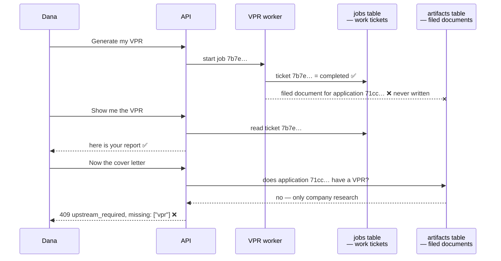
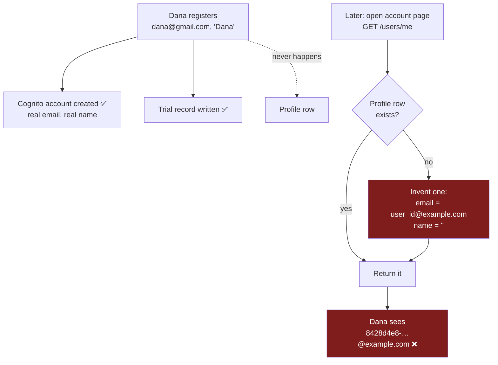
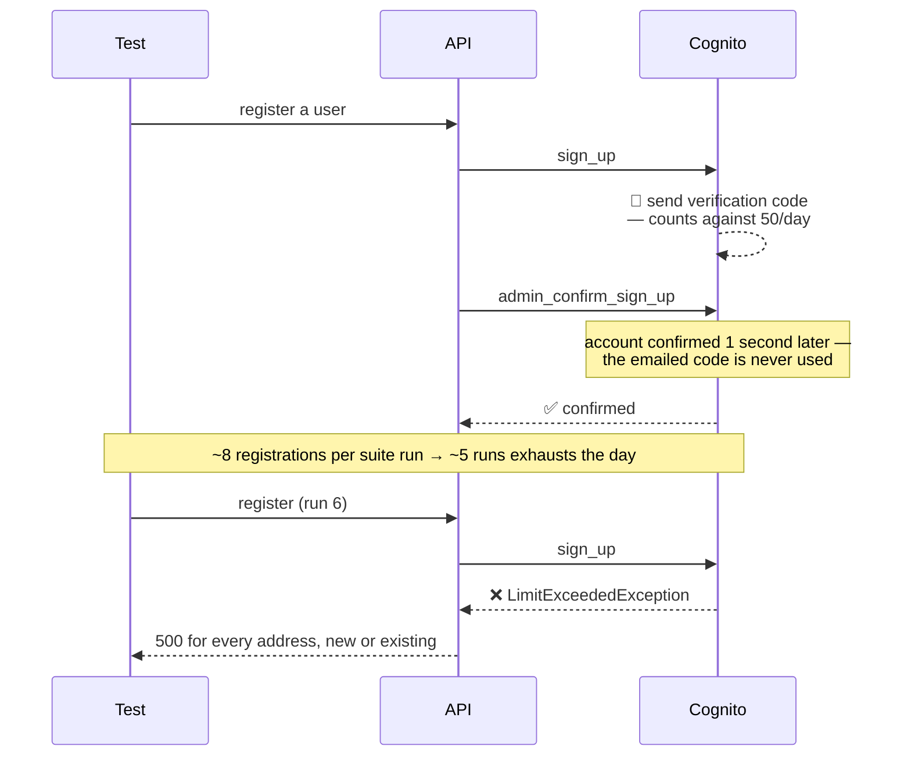

# The three remaining failures, in plain English

Companion to `wave3-3fixharness-live-suite-20260801T161402Z.md`. That file is the evidence;
this one is the explanation. No prior knowledge of the codebase is assumed.

**Where we are.** The two live-API test suites could not log in at all, so for a long time they
proved nothing. That is fixed. They now get all the way through the value-proposition report
before stopping. Three tests still fail, for **two** distinct reasons — and separately, the
environment ran out of registration emails while we were testing.

```
BEFORE   8 failed,  4 passed, 12 skipped   ← every failure a login failure at the first door
AFTER    3 failed, 13 passed, 12 skipped   ← two real defects, both now visible and named
```

---

## Failure 1 and 2 — the cover letter cannot see the report that was just written

**Known as `F-DEVX-1`. Owned by step `3.CORR`. Not fixed here, deliberately.**

### The use case

> Dana pastes a job posting, answers the ten gap questions, and asks for her Value Proposition
> Report. It generates. She reads it. Then she clicks **Generate cover letter** — and the app
> tells her she needs to generate a VPR first.
>
> The VPR is on the screen in front of her.

There is no way for Dana to get past this. Retrying does not help; the cover letter and the
interview prep are simply unreachable for the life of the account.

### What is actually happening

The system keeps two records of a finished report. One is a **work ticket** — "job number 7b7e…,
status: completed" — filed under the ticket number. The other is meant to be the **filed
document** — "the VPR belonging to application 71cc…" — filed under the *application*.

Only the work ticket is being written. The filed document never is. So when the cover letter asks
the filing cabinet "does this application have a VPR yet?", the answer is honestly no.



### The proof

For application `71cc1d43-…`, whose VPR reached `completed` and was successfully read back on
screen, the filing cabinet holds exactly **one** document:

```
applicationId = 71cc1d43-…    artifactId = ARTIFACT#COMPANY_RESEARCH#71cc1d43-…
```

The expected `ARTIFACT#VPR#v1` row is absent. Company research files itself correctly on the same
table — so a working reference implementation of the very same write already exists a few files
away.

### The tell that makes this diagnosable

**CV tailoring works.** It consumes the same completed VPR and succeeds every time. Only the
cover letter and the interview prep fail. That means the two features look for the report in
**different places** — CV tailoring finds the work ticket, the other two ask the filing cabinet.
That asymmetry is the shortest path to the fix.

### Options

| | Option | What it costs | Verdict |
|---|---|---|---|
| **A** | Write the filed document when the VPR completes — mirror what company research already does | Small, in the VPR completion path | **Recommended.** Fixes the cause, and the two working reference implementations are already in the repo |
| **B** | Make the cover letter and interview prep read the work ticket, like CV tailoring does | Also small | Rejected — it spreads the inconsistency instead of removing it, and D-H4 exists precisely to make the filing cabinet authoritative |
| **C** | Backfill the missing documents for existing accounts | A one-off script | **Needed alongside A**, or every account created before the fix stays permanently stuck |

Sizing and sequencing are `3.CORR`'s call, not this step's. What matters here is that **the test
harness will now prove the fix**: when the filed document starts appearing, both suites should run
green through the cover letter, and interview prep becomes reachable for the first time.

---

## Failure 3 — every user's profile shows a fake email address

**New finding. No owner assigned yet. Product code — not fixed here.**

### The use case

> Dana signs up as `dana@gmail.com`, with her name. She opens her account page.
>
> It greets her as nobody, with the email address
> `8428d4e8-d071-7088-a9c3-9e630806436b@example.com`.

She never typed that. It does not exist. It is not a display bug — it is what the system has
recorded as her identity.

### What is actually happening

Registration creates the Cognito login and a trial record. **It never creates the profile row.**

The profile is instead created lazily, the first time anything reads `/users/me`. The code that
creates it does not have the real email to hand, so it invents one from the internal user id and
leaves the name blank.



Confirmed directly against the live table. The invented address is written to storage, not
computed for display — so it persists, and it is what every later read returns.

### Why it may be worse than cosmetic — worth checking, not asserted

The users table carries an `email-index`, and the P-24 identity resolver uses that index for
"find the owner by their verified email". Today **no** profile carries a real email address, so
that lookup could never find anyone by the address they actually signed up with.

That path is **dormant on `devx` right now** — the live API uses the standard Cognito authorizer,
not the P-24 resolver — which bounds the blast radius today. But the debt is latent for whenever
P-24 goes live. Someone who knows the P-24 design should confirm whether this matters.

### Options

| | Option | What it costs | Verdict |
|---|---|---|---|
| **A** | Fill the profile from the login claims the gateway already provides, instead of inventing one | Smallest change; the real email and name are already present in the request | **Recommended.** It also **self-heals** — the 57 existing broken profiles correct themselves on next read, no backfill needed |
| **B** | Write the profile during registration, next to the trial record | Similar size | Works, but leaves the invent-a-fake-address code in place as a live fallback, and needs a separate backfill for existing accounts |
| **C** | Stop inventing an address; return an error when the profile is missing | Very small | Rejected on its own — it converts a wrong answer into an outage without giving anyone a right answer |

**A and C together** are the honest end state: fill from claims, and stop fabricating identity
data as a fallback. Whoever picks this up should confirm the `email-index` question above first,
because it decides whether this is a cosmetic fix or a correctness one.

---

## Not a test failure — the environment ran out of registration emails

**Filed as `I-07` (the cap) and `I-08` (production SES) in `ISSUES.md`. Not fixed here.**

### The use case

> An engineer runs the live test suites for the fifth time today. Every single test fails at the
> first step — not a login failure this time, but a 500 on *creating* an account. So does
> everyone else's run, on every branch, for the rest of the day. Re-running an old account does
> not help either.

### What is actually happening

The login pool is on Amazon's built-in email sender, capped at **50 messages per day for the
whole pool**. Every signup triggers a verification email.

But in every non-production environment, the backend confirms the account **programmatically,
about a second later**. Nobody ever reads the emailed code.



**The daily budget is spent entirely on mail that has no recipient and no purpose.**

### Options

| | Option | Scope | Verdict |
|---|---|---|---|
| **A** | Reuse one test account instead of registering per test | Test code only, already built and opt-in via `TEST_USER_EMAIL` / `TEST_USER_PASSWORD` | **Already in place as a fallback.** Flipping it to the default takes the suites from ~5 runs/day to ~50, and needs no infrastructure change |
| **B** | Add a PreSignUp trigger that auto-confirms in non-prod, so Cognito sends **no** signup mail at all | `infra/` — which is **3.4's lock** | **Recommended real fix for `devx`.** Removes the cap entirely rather than rationing it, and lets the backend drop its `admin_confirm_sign_up` workaround. Filed as **`I-07`** |
| **C** | Move the pool onto SES with a verified domain | `infra/` + DNS + an AWS sandbox-exit request | **Required for production regardless**, and it has lead time. Filed as **`I-08`** |

**These are layers, not alternatives.** A is the stopgap and is already available. B fixes `devx`
properly and makes A unnecessary. C is unavoidable before launch — the same setting that merely
annoys an engineer in `devx` will cap real signups and break *all* password recovery in
production, because the pool is configured for email-only account recovery.

---

## Summary

| # | Failure | Who a user is | Owner | Recommended remedy |
|---|---|---|---|---|
| 1–2 | Cover letter and interview prep are permanently unreachable after a successful VPR | Blocked from two of the six features, with no workaround | `3.CORR` | File the VPR as a canonical artifact on completion, mirroring company research, plus a backfill for existing accounts |
| 3 | Every profile shows an invented `@example.com` address and a blank name | Sees a stranger's identity on their own account page | **unassigned** | Fill the profile from the login claims already present in the request — self-healing, no backfill |
| — | Registration dies for the day after ~5 test runs | Engineers blocked; in production, signup and password reset would both fail | `I-07` / `I-08` | PreSignUp trigger for non-prod now; SES before launch. Test-code stopgap already in place |

Two of the three failures were **invisible** before this step — the suites failed at the login
door and never reached them. That is the point of the work: the harness now fails for reasons
that name themselves.
