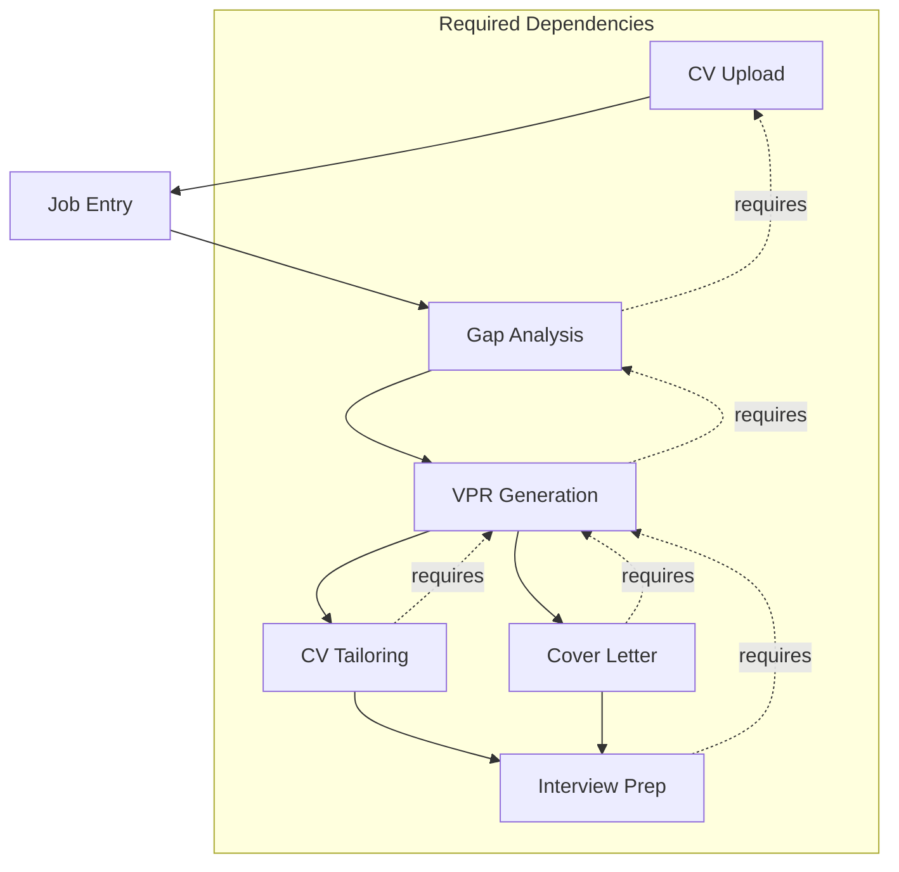

# Critical Corrections Resolution Prompt

**Document Version:** 1.0
**Date:** 2026-02-14
**Purpose:** Design comprehensive solutions for remaining CRITICAL_CORRECTIONS items
**Output:** Machine-readable spec files and execution_runbook.md updates

---

## Table of Contents

1. [Problem Statement](#1-problem-statement)
2. [Required Solutions](#2-required-solutions)
3. [Deliverables](#3-deliverables)
4. [Constraints](#4-constraints)
5. [Validation Requirements](#5-validation-requirements)
6. [Reference Information](#6-reference-information)
7. [Evaluation Criteria](#7-evaluation-criteria)
8. [Output Format](#8-output-format)

---

## 1. Problem Statement

### 1.1 Overview

The CRITICAL_CORRECTIONS.md document identified 5 critical items requiring resolution. Analysis of `docs/refactor/execution_runbook.md` and `docs/refactor/execution_results.md` reveals:

| # | Issue | Status | Gap |
|---|-------|--------|-----|
| 1 | **JSA Prompts (4 missing)** | PARTIAL | `knowledge_base_prompt.py` not in runbook |
| 2 | **API Contract** | MISSING | No complete API documentation |
| 3 | **Workflow (CV → Gap → VPR)** | PARTIAL | Dependencies not explicitly documented |
| 4 | **Bedrock → Anthropic** | MISSING | Migration not in runbook |
| 5 | **Tasks alignment** | MISSING | No docs/tasks/ mapping |

### 1.2 Current State Analysis

#### Problem 1: Missing JSA Prompts

**Current State:**
| Prompt File | Location | Status |
|------------|---------|--------|
| `vpr_prompt.py` | `src/backend/careervp/logic/prompts/vpr_prompt.py` | EXISTS |
| `gap_analysis_prompt.py` | `src/backend/careervp/logic/prompts/gap_analysis_prompt.py` | EXISTS |
| `cv_tailoring_prompt.py` | `src/backend/careervp/logic/prompts/cv_tailoring_prompt.py` | EXISTS |
| `cover_letter_prompt.py` | `src/backend/careervp/logic/prompts/cover_letter_prompt.py` | EXISTS |
| `interview_prep_prompt.py` | `src/backend/careervp/logic/prompts/interview_prep_prompt.py` | TO_BE_CREATED |
| `company_research_prompt.py` | `src/backend/careervp/logic/prompts/company_research_prompt.py` | TO_BE_CREATED (Phase X) |
| `fvs_prompt.py` | `src/backend/careervp/logic/prompts/fvs_prompt.py` | TO_BE_CREATED |
| `knowledge_base_prompt.py` | `src/backend/careervp/logic/prompts/knowledge_base_prompt.py` | **NOT IN RUNBOOK** |

**Impact:** Incomplete prompt library leads to inconsistent AI behavior.

---

#### Problem 2: Missing API Contract

**Current State:**
- No single source of truth for API definitions
- Handlers have ad-hoc request/response schemas
- No standardized error codes documented
- No OpenAPI/Swagger specification

**Required:**
| Component | Description |
|----------|-------------|
| Endpoint Definitions | All REST endpoints with methods |
| Request Schemas | Pydantic models for validation |
| Response Schemas | Standard response formats |
| Error Codes | Machine-readable error codes |
| Authentication | JWT validation, scopes |

---

#### Problem 3: Workflow Dependencies Not Documented

**Correct User Flow:**
```
CV Upload → Job Entry → Gap Analysis → VPR Generation → CV Tailoring → Cover Letter → Interview Prep
     ↓            ↓              ↓             ↓              ↓             ↓              ↓
  Required   Required      Required      Required         Required       Required        Optional
```

**Missing Documentation:**
- Dependency matrix between features
- Workflow enforcement logic
- Data flow diagrams
- Pre-requisite validation

---

#### Problem 4: Bedrock → Anthropic Migration Not Started

**Current State:**
| Component | Current | Target |
|-----------|---------|--------|
| LLM Client | `src/backend/careervp/logic/llm_client.py` uses Bedrock | Direct Anthropic API |
| Model Routing | Not implemented | Sonnet/Haiku routing |
| Cost Tracking | Not implemented | Token usage tracking |
| API Keys | Bedrock credentials | Anthropic API keys |

**Required Changes:**
- Replace `bedrock-runtime` with direct HTTP calls
- Implement model routing (Sonnet vs Haiku)
- Add cost estimation
- Handle rate limiting

---

#### Problem 5: Tasks Alignment Missing

**Current State:**
| Phase | Runbook Reference | docs/tasks/ Alignment |
|-------|-------------------|----------------------|
| Phase 0 | Infra | `00-infra/`, `00-gap-remediation/` |
| Phase 1 | Models | Not aligned |
| Phase 2 | Cost Optimization | Not aligned |
| Phase 3 | VPR Generator | `03-vpr-generator/` |
| Phase 4 | CV Tailoring | `09-cv-tailoring/` |
| Phase 5 | Gap Analysis | `11-gap-analysis/` |
| Phase 6 | Cover Letter | `10-cover-letter/` |
| Phase 7 | Quality Validator | Not aligned |
| Phase 8 | Knowledge Base | `13-knowledge-base/` (MISSING) |
| Phase 9 | Interview Prep | Not in docs/tasks/ |

**Required:**
- Phase-to-task mapping matrix
- File alignment table
- Dependency graph

---

## 2. Required Solutions

### Solution 1: Complete JSA Prompt Library

**Output File:** `docs/refactor/specs/prompt_library_complete_spec.yaml`

**Deliverables:**
| # | Prompt File | Status | Purpose |
|---|-------------|---------|---------|
| 1.1 | `interview_prep_prompt.py` | CREATE | Generate STAR-formatted interview questions |
| 1.2 | `fvs_prompt.py` | CREATE | Quality validation prompts |
| 1.3 | `knowledge_base_prompt.py` | CREATE | Knowledge storage/retrieval prompts |
| 1.4 | Update `prompt_library_spec.yaml` | UPDATE | Include all 8 prompts |

**Existing Prompts to Reference:**
- `src/backend/careervp/logic/prompts/vpr_prompt.py`
- `src/backend/careervp/logic/prompts/gap_analysis_prompt.py`
- `src/backend/careervp/logic/prompts/cv_tailoring_prompt.py`
- `src/backend/careervp/logic/prompts/cover_letter_prompt.py`

---

### Solution 2: API Contract Specification

**Output File:** `docs/refactor/specs/api_contract_spec.yaml`

**Deliverables:**
| # | Component | Description |
|---|-----------|-------------|
| 2.1 | Endpoint Definitions | All REST endpoints with methods |
| 2.2 | Request Schemas | Pydantic models for each endpoint |
| 2.3 | Response Schemas | Standard response format |
| 2.4 | Error Codes | Machine-readable error codes |
| 2.5 | Authentication | JWT validation, scopes |

**Endpoints to Document:**
```yaml
/endpoints:
  /auth:
    POST /auth/register
    POST /auth/login
    POST /auth/refresh

  /users:
    GET /users/me
    PUT /users/me
    POST /users/me/cv
    GET /users/me/cvs

  /jobs:
    POST /jobs
    GET /jobs/{id}
    GET /users/me/jobs

  /vpr:
    POST /vpr/generate
    GET /vpr/{id}
    GET /users/me/vprs

  /gap-analysis:
    POST /gap-analysis/questions
    POST /gap-analysis/responses
    GET /gap-analysis/{job_id}/questions

  /cv-tailoring:
    POST /cv-tailoring/generate
    GET /cv-tailoring/{id}
    GET /users/me/tailored-cvs

  /cover-letter:
    POST /cover-letter/generate
    GET /cover-letter/{id}
    GET /users/me/cover-letters

  /interview-prep:
    POST /interview-prep/generate
    GET /interview-prep/{id}
    GET /users/me/interview-preps

  /company-research:
    POST /company-research/fetch
    GET /company-research/{job_id}
```

---

### Solution 3: Workflow Dependencies Specification

**Output File:** `docs/refactor/specs/workflow_dependencies_spec.yaml`

**Deliverables:**
| # | Component | Description |
|---|-----------|-------------|
| 3.1 | Workflow Diagram | ASCII/Mermaid data flow |
| 3.2 | Dependency Matrix | Feature → Required Dependencies |
| 3.3 | Enforcement Logic | Pre-requisite validation |
| 3.4 | Data Flow | Data passed between features |

**Workflow Diagram:**


**Dependency Matrix:**
| Feature | Requires | Optional |
|---------|----------|----------|
| CV Upload | - | - |
| Job Entry | CV Upload | - |
| Gap Analysis | CV Upload, Job Entry | - |
| VPR Generation | Gap Analysis | Company Research |
| CV Tailoring | VPR Generation | - |
| Cover Letter | VPR Generation, Gap Analysis | Company Research |
| Interview Prep | VPR Generation, Gap Analysis | - |

---

### Solution 4: LLM Client Migration (Bedrock → Anthropic)

**Output File:** `docs/refactor/specs/llm_client_migration_spec.yaml`

**Deliverables:**
| # | Component | Description |
|---|-----------|-------------|
| 4.1 | AnthropicClient | Direct HTTP client for Anthropic API |
| 4.2 | LLMRouter | Model routing (Sonnet/Haiku) |
| 4.3 | CostEstimator | Token usage and cost tracking |
| 4.4 | RateLimiter | Request rate limiting |
| 4.5 | Migration Script | Bedrock → Anthropic migration |

**File Changes:**
| File | Action | Description |
|------|--------|-------------|
| `src/backend/careervp/logic/llm_client.py` | REPLACE | Direct Anthropic client |
| `src/backend/careervp/logic/llm_router.py` | CREATE | Model routing |
| `src/backend/careervp/logic/cost_estimator.py` | CREATE | Cost tracking |
| `src/backend/careervp/logic/rate_limiter.py` | CREATE | Rate limiting |

**Model Routing:**
| Feature | Model | Temperature | Max Tokens |
|---------|-------|-------------|------------|
| VPR Generation | Claude Sonnet 4.5 | 0.7 | 8192 |
| Gap Analysis | Claude Sonnet 4.5 | 0.3 | 4096 |
| CV Tailoring | Claude Haiku 4.5 | 0.3 | 4096 |
| Cover Letter | Claude Haiku 4.5 | 0.5 | 4096 |
| Interview Prep | Claude Haiku 4.5 | 0.5 | 4096 |
| Quality Validation | Claude Sonnet 4.5 | 0.1 | 2048 |
| Company Research | Claude Haiku 4.5 | 0.7 | 1024 |

---

### Solution 5: Tasks Alignment Matrix

**Output File:** `docs/refactor/specs/tasks_alignment_spec.yaml`

**Deliverables:**
| # | Component | Description |
|---|-----------|-------------|
| 5.1 | Phase-to-Task Mapping | Runbook phase → docs/tasks/ files |
| 5.2 | File Alignment Table | Source files → Target files |
| 5.3 | Dependency Graph | Task dependencies |

**Phase-to-Task Mapping:**
| Phase | Runbook Section | docs/tasks/ Directory | Alignment |
|-------|-----------------|----------------------|-----------|
| Phase 0 | Security Foundation | `00-infra/`, `00-gap-remediation/` | ✅ Aligned |
| Phase 1 | Model Unification | - | ❌ No task |
| Phase 2 | Cost Optimization | - | ❌ No task |
| Phase 3 | VPR 6-Stage | `03-vpr-generator/` | ✅ Partial |
| Phase 4 | CV Tailoring | `09-cv-tailoring/` | ✅ Aligned |
| Phase 5 | Gap Analysis | `11-gap-analysis/` | ✅ Aligned |
| Phase 6 | Cover Letter | `10-cover-letter/` | ✅ Aligned |
| Phase 7 | Quality Validator | - | ❌ No task |
| Phase 8 | Knowledge Base | `13-knowledge-base/` | ❌ MISSING |
| Phase 9 | Interview Prep | - | ❌ No task |

---

## 3. Deliverables

### 3.1 Spec Files to Create/Update

| # | Spec File | Action | Purpose |
|---|-----------|--------|---------|
| D1 | `docs/refactor/specs/prompt_library_complete_spec.yaml` | UPDATE | Complete 8-prompt library |
| D2 | `docs/refactor/specs/api_contract_spec.yaml` | CREATE | API documentation |
| D3 | `docs/refactor/specs/workflow_dependencies_spec.yaml` | CREATE | Workflow dependencies |
| D4 | `docs/refactor/specs/llm_client_migration_spec.yaml` | CREATE | LLM client migration |
| D5 | `docs/refactor/specs/tasks_alignment_spec.yaml` | CREATE | Tasks mapping |

### 3.2 Code Files to Create

| # | File | Purpose |
|---|------|---------|
| C1 | `src/backend/careervp/logic/prompts/interview_prep_prompt.py` | Interview prep prompts |
| C2 | `src/backend/careervp/logic/prompts/fvs_prompt.py` | FVS prompts |
| C3 | `src/backend/careervp/logic/prompts/knowledge_base_prompt.py` | KB prompts |
| C4 | `src/backend/careervp/logic/llm_router.py` | Model routing |
| C5 | `src/backend/careervp/logic/cost_estimator.py` | Cost tracking |
| C6 | `src/backend/careervp/logic/rate_limiter.py` | Rate limiting |

### 3.3 Test Files to Create

| # | File | Purpose |
|---|------|---------|
| T1 | `tests/unit/test_interview_prep_prompt.py` | Interview prep prompt tests |
| T2 | `tests/unit/test_fvs_prompt.py` | FVS prompt tests |
| T3 | `tests/unit/test_knowledge_base_prompt.py` | KB prompt tests |
| T4 | `tests/unit/test_llm_router.py` | Model routing tests |
| T5 | `tests/unit/test_cost_estimator.py` | Cost tracking tests |
| T6 | `tests/integration/test_api_contract.py` | API contract tests |
| T7 | `tests/integration/test_workflow_dependencies.py` | Workflow tests |

### 3.4 Execution Runbook Updates

**Add new phases after Phase 1:**

```markdown
## Phase 1.5: JSA Prompt Library Completion

**Duration:** 0.5 days | **Effort:** 4 hours

### Specs
| Type | File | Purpose |
|------|------|---------|
| Mandatory | `prompt_library_complete_spec.yaml` | Complete prompt library |
| Reference | `prompt_library_spec.yaml` | Existing prompts |

### Step 1.5.1: Create Interview Prep Prompt

**CODE:**
```bash
# VSCode + Anthropic Haiku
"""
Create interview_prep_prompt.py per prompt_library_complete_spec.yaml:

1. Create: src/backend/careervp/logic/prompts/interview_prep_prompt.py
   - System prompt for STAR-formatted questions
   - User prompt template
   - Output schema

2. Create: tests/unit/test_interview_prep_prompt.py

KNOWLEDGE: docs/refactor/specs/prompt_library_complete_spec.yaml
"""
```

### Step 1.5.2: Create FVS Prompt

**CODE:**
```bash
# VSCode + Anthropic Haiku
"""
Create fvs_prompt.py per prompt_library_complete_spec.yaml:

1. Create: src/backend/careervp/logic/prompts/fvs_prompt.py
   - Grammar validation prompt
   - Tone validation prompt
   - Anti-AI detection prompt
   - Output schema

2. Create: tests/unit/test_fvs_prompt.py

KNOWLEDGE: docs/refactor/specs/prompt_library_complete_spec.yaml
"""
```

### Step 1.5.3: Create Knowledge Base Prompt

**CODE:**
```bash
# VSCode + Anthropic Haiku
"""
Create knowledge_base_prompt.py per prompt_library_complete_spec.yaml:

1. Create: src/backend/careervp/logic/prompts/knowledge_base_prompt.py
   - Knowledge storage prompt
   - Knowledge retrieval prompt
   - Output schema

2. Create: tests/unit/test_knowledge_base_prompt.py

KNOWLEDGE: docs/refactor/specs/prompt_library_complete_spec.yaml
"""
```

---

## Phase 1.6: API Contract Documentation

**Duration:** 0.5 days | **Effort:** 4 hours

### Specs
| Type | File | Purpose |
|------|------|---------|
| Mandatory | `api_contract_spec.yaml` | API documentation |

### Step 1.6.1: Document API Endpoints

**CODE:**
```bash
# VSCode + Anthropic Sonnet
"""
Document API contract per api_contract_spec.yaml:

1. Create: src/backend/careervp/api_contract.py
   - Endpoint definitions
   - Request schemas
   - Response schemas
   - Error codes

2. Create: tests/integration/test_api_contract.py

KNOWLEDGE: docs/refactor/specs/api_contract_spec.yaml
"""
```

---

## Phase 1.7: Workflow Dependencies

**Duration:** 0.5 days | **Effort:** 4 hours

### Specs
| Type | File | Purpose |
|------|------|---------|
| Mandatory | `workflow_dependencies_spec.yaml` | Workflow documentation |

### Step 1.7.1: Implement Workflow Enforcer

**CODE:**
```bash
# VSCode + Anthropic Sonnet
"""
Implement workflow dependencies per workflow_dependencies_spec.yaml:

1. Create: src/backend/careervp/logic/workflow_enforcer.py
   - Dependency validation
   - Pre-requisite checking
   - Data flow management

2. Create: tests/integration/test_workflow_dependencies.py

KNOWLEDGE: docs/refactor/specs/workflow_dependencies_spec.yaml
"""
```

---

## Phase 1.8: LLM Client Migration

**Duration:** 1 day | **Effort:** 8 hours

### Specs
| Type | File | Purpose |
|------|------|---------|
| Mandatory | `llm_client_migration_spec.yaml` | Migration documentation |

### Step 1.8.1: Create Anthropic Client

**CODE:**
```bash
# VSCode + Anthropic Sonnet
"""
Create Anthropic client per llm_client_migration_spec.yaml:

1. Create: src/backend/careervp/logic/anthropic_client.py
   - Direct HTTP client
   - Model routing
   - Cost estimation
   - Rate limiting

2. Create: tests/unit/test_llm_router.py
3. Create: tests/unit/test_cost_estimator.py

KNOWLEDGE: docs/refactor/specs/llm_client_migration_spec.yaml
"""
```

### Step 1.8.2: Migrate LLM Client

**CODE:**
```bash
# VSCode + Anthropic Haiku
"""
Migrate llm_client.py per llm_client_migration_spec.yaml:

1. UPDATE: src/backend/careervp/logic/llm_client.py
   - Replace Bedrock with Anthropic
   - Add model routing
   - Add cost tracking

2. Run: tests/unit/test_llm_client.py

KNOWLEDGE: docs/refactor/specs/llm_client_migration_spec.yaml
"""
```

---

## Phase 1.9: Tasks Alignment

**Duration:** 0.5 days | **Effort:** 4 hours

### Specs
| Type | File | Purpose |
|------|------|---------|
| Mandatory | `tasks_alignment_spec.yaml` | Tasks mapping |

### Step 1.9.1: Create Alignment Matrix

**CODE:**
```bash
# VSCode + Anthropic Haiku
"""
Create tasks alignment per tasks_alignment_spec.yaml:

1. Create: src/backend/careervp/tasks_alignment.py
   - Phase-to-task mapping
   - File alignment table
   - Dependency graph

2. Create: tests/unit/test_tasks_alignment.py

KNOWLEDGE: docs/refactor/specs/tasks_alignment_spec.yaml
"""
```

---

### Verification (All Phases 1.5-1.9)
```bash
cd /Users/yitzchak/Documents/dev/careervp/src/backend

# Run all new tests
uv run pytest tests/unit/test_*prompt.py tests/unit/test_llm_*.py tests/integration/test_api_contract.py tests/integration/test_workflow_*.py -v

# Run lint
uv run ruff check careervp/logic/prompts/ careervp/logic/llm_*.py careervp/logic/workflow_*.py

# Run type check
uv run mypy careervp/logic/prompts/ careervp/logic/llm_*.py careervp/logic/workflow_*.py --strict
```

---

## 4. Constraints

### 4.1 Technical Constraints

| Category | Constraint | Source |
|----------|------------|--------|
| **API** | REST endpoints per api_contract_spec.yaml | API design |
| **Authentication** | JWT validation for all endpoints | Security spec |
| **Models** | Pydantic v2 for all schemas | Existing codebase |
| **LLM** | Claude Sonnet/Haiku 4.5 | CLAUDE.md |
| **API** | Direct Anthropic API (no Bedrock) | Cost optimization |
| **Logging** | AWS Lambda Powertools | Existing pattern |

### 4.2 Code Quality Constraints

| Constraint | Tool | Command |
|------------|------|---------|
| **Lint** | Ruff | `uv run ruff check careervp/` |
| **Type Check** | Mypy strict | `uv run mypy careervp/ --strict` |
| **Test Coverage** | pytest-cov | `uv run pytest --cov=careervp` |
| **Import Order** | isort | `uv run isort careervp/` |

### 4.3 Integration Constraints

| Constraint | Description |
|------------|-------------|
| **Backward Compatibility** | Existing handlers must continue to work |
| **No Breaking Changes** | Public APIs must remain stable |
| **Performance** | LLM calls must complete within SLA |
| **Cost** | Must reduce costs vs Bedrock |

---

## 5. Validation Requirements

### 5.1 Functional Validations

| Requirement | Validation Method | Success Criteria |
|------------|------------------|-------------------|
| All prompts exist | File check | 8 prompt files exist |
| API contract complete | Schema validation | All endpoints documented |
| Workflow dependencies | Integration test | Dependencies enforced |
| LLM migration | API test | Anthropic API works |
| Tasks aligned | Mapping check | All tasks mapped |

### 5.2 Code Quality Validations

| Requirement | Tool | Pass Criteria |
|------------|------|---------------|
| Lint | Ruff | 0 errors |
| Type Check | Mypy strict | 0 errors |
| Tests | pytest | 100% passing |
| Coverage | pytest-cov | >= 80% |

### 5.3 Performance Validations

| Requirement | Metric | Target |
|------------|--------|--------|
| LLM latency | Response time | < 30s for all features |
| API latency | Response time | < 500ms |
| Cost | Per-request cost | < $0.01 |

---

## 6. Reference Information

### 6.1 Existing Files to Reference

| File | Purpose |
|------|---------|
| `docs/refactor/CRITICAL_CORRECTIONS.md` | Original requirements |
| `docs/refactor/EXECUTION_RUNBOOK.md` | Execution guidance |
| `docs/refactor/specs/prompt_library_spec.yaml` | Existing prompt spec |
| `src/backend/careervp/logic/prompts/vpr_prompt.py` | VPR prompt pattern |
| `src/backend/careervp/logic/llm_client.py` | Current LLM client |
| `CLAUDE.md` | AI model strategy |

### 6.2 API Patterns to Follow

| Pattern | Example |
|---------|---------|
| Request Schema | `CVParseRequest` in `models/cv.py` |
| Response Schema | `APIResponse` pattern |
| Error Codes | `ResultCode` enum |
| Handler Pattern | Function-based Powertools |

### 6.3 Test Patterns

| Pattern | Example |
|---------|---------|
| Unit Test | `tests/unit/test_cv_models.py` |
| Integration Test | `tests/integration/test_knowledge_base_flow.py` |
| E2E Test | `tests/e2e/test_workflow.py` |

---

## 7. Evaluation Criteria

| Criterion | Weight | Description |
|-----------|--------|-------------|
| **Completeness** | 30% | All 5 solutions implemented |
| **Correctness** | 25% | Code matches spec |
| **Quality** | 20% | Lint, type-check, tests pass |
| **Integration** | 15% | Works with existing codebase |
| **Documentation** | 10% | Clear comments, docs |

---

## 8. Output Format

### 8.1 Spec File Template (YAML)

```yaml
spec_version: "1.0"
date_created: "2026-02-14"
date_updated: "2026-02-14"

# ... specification content ...

validation:
  functional: []
  code_quality: []
  performance: []

dependencies: []

output_files: []

verification_commands: []
```

### 8.2 Runbook Phase Template (Markdown)

```markdown
## Phase X.X: [Phase Name]

**Duration:** X days | **Effort:** X hours

### Specs
| Type | File | Purpose |
|------|------|---------|

### Step X.X.X: [Step Name]

**CODE:**
```bash
# VSCode + Anthropic [Model]
"""
[Prompt for Claude Code]
"""
```

### Verification
```bash
[Commands]
```
```

---

## Output Checklist

Before submitting, verify:

- [ ] All 5 spec files created/updated
- [ ] All code files created
- [ ] All test files created
- [ ] execution_runbook.md updated with new phases
- [ ] All tests pass
- [ ] Lint clean
- [ ] Type-check passes
- [ ] Documentation complete

---

**BEGIN YOUR DESIGN AND IMPLEMENTATION**
