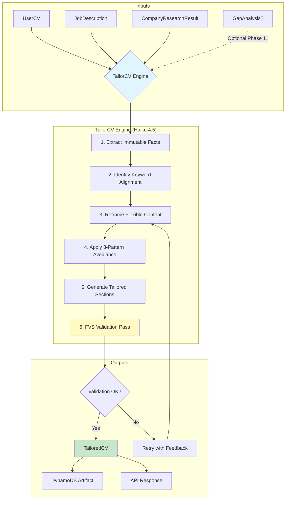

# Feature Spec: CV Tailoring (F-CVT-001)

## Overview

CV Tailoring transforms a user's base CV into a job-specific, ATS-optimized document by intelligently reframing experiences and skills to match a target job description. Uses Claude Haiku 4.5 (Template Strategy) for cost-efficient, high-volume processing with built-in anti-AI-detection safeguards.

## System Flow



## Implementation Requirements

- **Location:** `src/backend/careervp/logic/cv_tailor.py`
- **Handler:** `src/backend/careervp/handlers/cv_tailor_handler.py`
- **Models:** `src/backend/careervp/models/tailor.py`
- **Prompts:** `src/backend/careervp/logic/prompts/cv_tailor_prompt.py`

### Core Logic

1. **Input Aggregation:** Combine UserCV, JobDescription, and CompanyResearchResult into unified context
2. **Fact Extraction:** Parse immutable facts (dates, titles, company names) that cannot be altered
3. **Keyword Mapping:** Identify job requirement keywords and map to CV evidence
4. **Content Reframing:** Transform flexible content (summaries, bullet points) to match job language
5. **Anti-Detection Processing:** Apply 8-pattern avoidance framework to ensure authentic tone
6. **FVS Validation:** Verify no hallucinated facts, dates, or credentials
7. **Artifact Storage:** Persist TailoredCV with `PK=application_id`, `SK=ARTIFACT#TAILORED_CV#v{version}`

### Safety & Error Handling

- Wrap all operations in `Result[T]` pattern
- Retry LLM calls up to 3 times with exponential backoff
- Log all transformations for audit trail
- Return `ResultCode.FVS_HALLUCINATION_DETECTED` if validation fails after retries

### Tracing

- Use `@tracer.capture_method(capture_response=False)` on all logic functions
- Emit metrics: `CVTailoringRequests`, `CVTailoringLatency`, `CVTailoringErrors`
- Append context keys: `user_id`, `application_id`, `job_id`

## Prompt Strategy: Few-Shot Templating for Haiku 4.5

### Template Structure

```
SYSTEM: You are a professional CV optimization specialist. Your task is to tailor
a candidate's CV to match a specific job description while maintaining complete
factual accuracy.

CRITICAL CONSTRAINTS:
- NEVER fabricate dates, titles, company names, degrees, or certifications
- ONLY reframe descriptions using evidence from the source CV
- Match the candidate's original writing style and vocabulary level
- Apply natural language patterns (avoid AI-detectable phrasing)

FEW-SHOT EXAMPLES:
[Example 1: Software Engineer → Senior Engineer role]
[Example 2: Marketing Manager → Product Marketing role]
[Example 3: Data Analyst → Business Intelligence role]

ANTI-DETECTION REQUIREMENTS:
1. Avoid phrases: "leverage", "utilize", "spearheaded", "synergy", "cutting-edge"
2. Vary sentence length (mix 8-word and 20-word sentences)
3. Include one minor stylistic imperfection per section
4. Use industry jargon from the job description naturally
5. Maintain candidate's apparent experience level in tone
6. Avoid perfect parallel structure in bullet points
7. Include contractions where natural ("I've" not "I have")
8. Mirror terminology from provided writing samples when available

INPUT CONTEXT:
{user_cv_json}
{job_description_json}
{company_research_json}
{gap_analysis_json?}

OUTPUT FORMAT:
{tailored_cv_schema}
```

### Few-Shot Example Pattern

Each example includes:
1. **Source CV snippet** (3-4 bullet points)
2. **Target job requirement** (specific skill/qualification)
3. **Tailored output** demonstrating keyword integration without fabrication
4. **Explanation** of what was reframed vs preserved

## API Schema

### Endpoint

```
POST /api/tailor-cv
Content-Type: application/json
Authorization: Bearer {jwt_token}
```

### Request Body

```json
{
  "user_id": "uuid-string",
  "application_id": "uuid-string",
  "job_id": "uuid-string",
  "cv_version": 1,
  "include_gap_analysis": false,
  "output_format": "json",
  "style_preferences": {
    "tone": "professional",
    "formality_level": "high",
    "include_summary": true
  }
}
```

### Request Model (Pydantic)

```python
class TailorCVRequest(BaseModel):
    """Request payload for CV tailoring endpoint."""

    user_id: Annotated[str, Field(description='User identifier')]
    application_id: Annotated[str, Field(description='Job application identifier')]
    job_id: Annotated[str, Field(description='Target job posting identifier')]
    cv_version: Annotated[int, Field(default=1, description='CV version to tailor', ge=1)]
    include_gap_analysis: Annotated[bool, Field(default=False, description='Include gap analysis in tailoring context')]
    output_format: Annotated[Literal['json', 'markdown'], Field(default='json', description='Output format')]
    style_preferences: Annotated[StylePreferences | None, Field(default=None, description='Optional styling preferences')]
```

### Response Body (Success - 200)

```json
{
  "success": true,
  "data": {
    "tailored_cv": {
      "contact_info": { ... },
      "executive_summary": "Tailored summary text...",
      "work_experience": [ ... ],
      "skills": [ ... ],
      "education": [ ... ],
      "certifications": [ ... ]
    },
    "metadata": {
      "application_id": "uuid-string",
      "version": 1,
      "created_at": "2025-01-29T12:00:00Z",
      "keyword_matches": 15,
      "sections_modified": ["executive_summary", "work_experience"],
      "fvs_validation_passed": true
    },
    "token_usage": {
      "input_tokens": 2500,
      "output_tokens": 1800,
      "model": "claude-haiku-4-5-20250315"
    }
  },
  "code": "CV_TAILORED"
}
```

### Response Body (Error - 422)

```json
{
  "success": false,
  "error": "FVS validation failed: hallucinated certification detected",
  "code": "FVS_HALLUCINATION_DETECTED",
  "details": {
    "field": "certifications",
    "violation": "AWS Solutions Architect not found in source CV"
  }
}
```

### Response Model (Pydantic)

```python
class TailorCVResponse(BaseModel):
    """Response payload from CV tailoring endpoint."""

    success: Annotated[bool, Field(description='Whether tailoring succeeded')]
    data: Annotated[TailoredCVData | None, Field(default=None, description='Tailored CV and metadata on success')]
    error: Annotated[str | None, Field(default=None, description='Error message on failure')]
    code: Annotated[str, Field(description='Machine-readable result code')]
    details: Annotated[dict[str, str] | None, Field(default=None, description='Additional error details')]
```

## Data Models

### TailoredCV

```python
class TailoredCV(BaseModel):
    """
    Tailored CV output optimized for specific job application.
    Per docs/specs/04-cv-tailoring.md.
    """

    contact_info: Annotated[ContactInfo, Field(description='IMMUTABLE - Contact details from source CV')]
    executive_summary: Annotated[str, Field(description='FLEXIBLE - Job-targeted professional summary')]
    work_experience: Annotated[list[TailoredWorkExperience], Field(description='MIXED - Reframed bullet points')]
    skills: Annotated[list[TailoredSkill], Field(description='VERIFIABLE - Skills from source CV with relevance scores')]
    education: Annotated[list[Education], Field(description='IMMUTABLE - Education copied from source')]
    certifications: Annotated[list[Certification], Field(description='IMMUTABLE - Certifications from source')]

    # Metadata
    source_cv_version: Annotated[int, Field(description='Version of source CV used')]
    target_job_id: Annotated[str, Field(description='Job posting this CV targets')]
    tailoring_version: Annotated[int, Field(default=1, description='Iteration of tailoring')]
```

### TailoredWorkExperience

```python
class TailoredWorkExperience(BaseModel):
    """Work experience entry with tailored descriptions."""

    # IMMUTABLE fields
    company_name: Annotated[str, Field(description='IMMUTABLE - Company name from source')]
    job_title: Annotated[str, Field(description='IMMUTABLE - Job title from source')]
    start_date: Annotated[str, Field(description='IMMUTABLE - Start date from source')]
    end_date: Annotated[str | None, Field(description='IMMUTABLE - End date from source')]
    location: Annotated[str | None, Field(description='IMMUTABLE - Location from source')]

    # FLEXIBLE fields
    description_bullets: Annotated[list[str], Field(description='FLEXIBLE - Reframed achievement bullets')]
    keyword_alignments: Annotated[list[str], Field(description='Keywords from job description matched')]
    original_bullets: Annotated[list[str], Field(description='Original bullets for FVS comparison')]
```

## DynamoDB Storage

- **PK:** `{application_id}`
- **SK:** `ARTIFACT#TAILORED_CV#v{version}`
- **GSI (USER_APPLICATIONS_INDEX):** `PK={user_id}`, `SK={application_id}`

## Success Criteria

1. **Accuracy:** 100% of immutable facts preserved from source CV
2. **Relevance:** ≥80% keyword coverage from job description
3. **Authenticity:** Passes manual anti-AI-detection review (spot-check 5%)
4. **Performance:** P95 latency ≤8 seconds for standard CV
5. **Cost:** ≤$0.015 per tailoring request (Haiku 4.5 pricing)

## Constraints

- **Max Input Size:** 15,000 tokens combined (CV + JD + Research)
- **Max Output Size:** 8,000 tokens for tailored CV
- **Timeout:** 60 seconds Lambda timeout
- **Memory:** 512 MB Lambda memory
- **Retries:** 3 attempts with 1s, 2s, 4s backoff
- **Rate Limit:** 10 requests/minute per user

## Dependencies

- Phase 1: UserCV model and parsing (F-CV-001)
- Phase 3: VPR Generator patterns (F-VPR-001)
- Phase 8: CompanyResearchResult (F-CR-001)
- Phase 11 (Future): GapAnalysis integration

## 8-Pattern Avoidance Framework Reference

Per CLAUDE.md Decision 1.6, all generated content must:

1. **Avoid AI Clichés:** No "leverage", "utilize", "spearheaded", "cutting-edge", "synergy"
2. **Vary Sentence Structure:** Mix short (8 words) and long (20+ words) sentences
3. **Include Imperfections:** One minor stylistic variation per section
4. **Avoid Perfect Parallelism:** Bullet points should not all follow same pattern
5. **Conversational Tone:** Natural language appropriate to experience level
6. **Domain Terminology:** Use jargon from the job posting naturally
7. **Use Contractions:** "I've managed" not "I have managed" where natural
8. **Match User Style:** Mirror vocabulary and tone from CV writing samples

## Related Documents

- [CLAUDE.md](../../CLAUDE.md) - Architecture decisions and AI strategy
- [docs/specs/01-cv-parser.md](01-cv-parser.md) - CV parsing specification
- [docs/specs/02-company-research.md](02-company-research.md) - Company research specification
- [docs/specs/03-vpr-generator.md](03-vpr-generator.md) - VPR generation patterns
- [docs/features/Prompt Library.md](../features/Prompt%20Library.md) - Prompt templates
